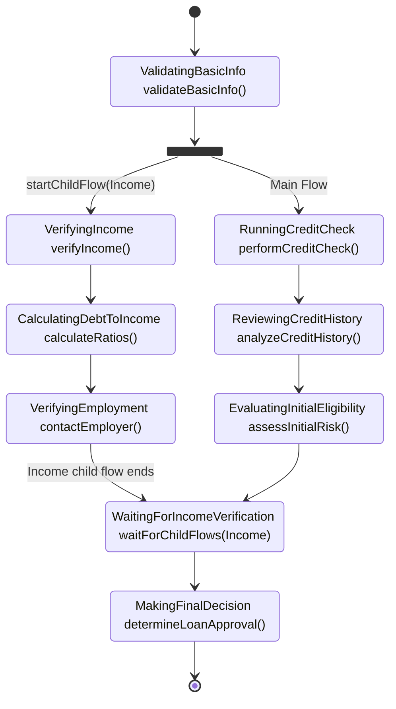

## Parallel Execution (Idea)

FlowLite achieves parallelism through parent-child flow relationships.

### Parent-Child Flow Model

FlowLite implements parallel execution using a parent-child flow model where:

- Parent flows can start one or more child flows
- Child flows execute independently and in parallel
- Parent flows can wait for specific child flows at designated stages
- The parent flow continues its own execution while child flows run

### Diagram Example

The following diagram illustrates a typical parent-child flow pattern:



### API for Parallel Execution

```kotlin
// Starting a child flow
fun <T : Any, R : Any> FlowBuilder<T>.startChildFlow(
    childFlowId: String,
    initialStateMapper: (parentState: T) -> R,
): FlowBuilder<T>

// Processing child flow results
fun <T : Any, R : Any> FlowBuilder<T>.waitForChildFlow(
    childFlowId: String,
    resultMapper: (parentState: T, childResult: R) -> T,
): FlowBuilder<T>
```
