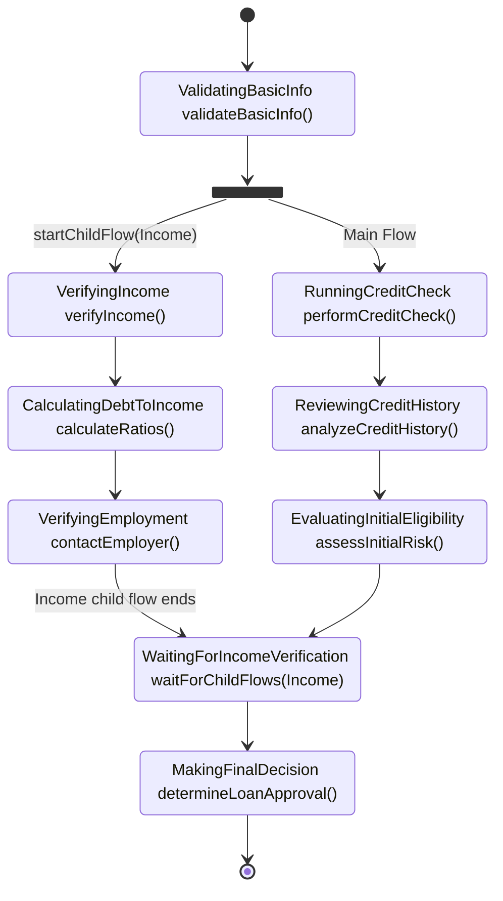

# FlowLite

FlowLite is a lightweight, developer-friendly workflow engine for Kotlin to define business processes in intuitive and maintainable way. 
It provides a fluent API for defining process flows that are both easy to code and easy to understand.

## Table of Contents

- [Why FlowLite?](#why-flowlite)
- [Assumptions](#assumptions)
  - [Error Handling](#error-handling)
- [Development Guide](#development-guide)
  - [Windows Setup](#windows-setup)
  - [Build and Test Commands](#build-and-test-commands)
  - [Code Structure](#code-structure)
  - [Core Architecture](#core-architecture)
  - [Stage Transitions](#stage-transitions)
  - [Development Notes](#development-notes)
  - [Code Documentation Guidelines](#code-documentation-guidelines)
- [TODO](#todo)
- [Process Example](#process-example)
  - [Diagram](#diagram)
  - [Code](#code)
- [Parallel Execution (Idea)](#parallel-execution-idea)
  - [Parent-Child Flow Model](#parent-child-flow-model)
  - [Diagram Example](#diagram-example)
  - [API for Parallel Execution](#api-for-parallel-execution)

## Why FlowLite?

Traditional business process management (BPM) solutions like Camunda are powerful but also complex and heavyweight. FlowLite offers:

- **Type-safe fluent API**: Leverage Kotlin's type system and language features to create robust workflows
- **Visual representation**: Automatically generates diagrams from your code
- **Minimal learning curve**: Natural syntax that reads like plain English
- **Lightweight**

## Assumptions

* FlowLite uses an Action-Oriented approach for stages, where stage names indicate ongoing activities (e.g., "InitializingPayment")
* Each stage has an associated StageStatus e.g. (PENDING, IN_PROGRESS, COMPLETED, ERROR)
* The combination of stage and StageStatus (plus eventually retry_count and retry configuration) fully defines what the engine should do next
* Execution of the next step in the flow is triggered by the "execute next step in flow instance x" message
* Assumptions for mermaid diagrams
  * The Rectangle represents stages with their associated actions. Format: StageName `actionName()`
  * Arrows represent transitions between stages, triggered by action completion (and StageStatus change) or events
  * Choice nodes represent routing decisions
  * Events can trigger stage transitions. They represent external triggers that change the process stage (e.g., `onEvent SwitchToCashPayment`)
  * Terminal stages are represented by transitions to `[*]`

### Error Handling

* Exceptions thrown from actions will cause the stage to fail
* FlowLite differentiates between two types of exceptions:
  * **Process Exceptions**: Unexpected errors that represent technical issues (database connection failures, system unavailability)
  * **Business Exceptions**: Expected exceptions that represent valid business cases (payment declined, validation errors) (those which implements `BusinessException` marker interface)
* Business exceptions are designed with the assumption that a process supervisor will review the case and potentially retry the stage with corrected data.
* Process errors can be retried via the FlowLite cockpit. Business exceptions are displayed differently (not yet decided how). 

## Development Guide

### Windows Setup

If you're cloning this repository on Windows, symbolic links (like `CLAUDE.md -> README.md`) require special Git configuration:

**Option 1: Enable symlinks globally (recommended)**
```bash
git config --global core.symlinks true
git clone <repository-url>
```

**Option 2: Clone with symlinks enabled**
```bash
git clone -c core.symlinks=true <repository-url>
```

**Requirements:** Git for Windows 2.10.2+, NTFS file system, and either Developer Mode enabled or Administrator privileges.

If symbolic links don't work, `CLAUDE.md` will appear as a text file containing "README.md" - in this case, just refer to README.md directly.

### Build and Test Commands
- `./gradlew build` - Build the entire project
- `./gradlew test` - Run all tests
- `./gradlew clean` - Clean build artifacts
- `./gradlew check` - Run all verification tasks

### Code Structure

FlowLite uses a **flat directory structure** to keep the codebase simple and organized:

- `source/` - All main source code (flat structure, no subdirectories for main package)
- `test/` - All test code (flat structure)
- Resources are placed directly in source directory alongside code files, not in a separate resources directory

### Core Architecture

#### Flow Definition System (`source/flowApi.kt`)
- `FlowBuilder<T>` - Fluent API for defining workflows
- `StageBuilder<T>` - Builder for individual stages within flows
- `EventBuilder<T>` - Builder for event-based transitions
- `Flow<T>` - Immutable flow definition container

#### Core Interfaces
- `Stage` - Enum-based stage definitions (action-oriented naming)
- `Event` - Enum-based event definitions for transitions
- `StatePersister<T>` - Interface for persisting workflow state

#### Flow Components
- `StageDefinition<T>` - Contains stage action, event handlers, condition handler, and next stage
- `ConditionHandler<T>` - Handles conditional branching
- `EventHandler<T>` - Handles event-based transitions
- `FlowEngine` - Runtime engine for executing flows

#### Diagram Generation (`source/MermaidGenerator.kt`)
- `MermaidGenerator` - Converts flow definitions to Mermaid diagrams

### Stage Transitions

FlowLite supports three types of stage transitions:

1. **Automatic Progression**: Sequential stages automatically flow to the next stage
   ```kotlin
   flow
       .stage(InitializingConfirmation, ::initializeOrderConfirmation)
       .stage(WaitingForConfirmation) // Automatic progression
   ```

2. **Event-Based Transitions**: Explicit events trigger transitions
   ```kotlin
   flow.onEvent(PaymentConfirmed).stage(ProcessingPayment, ::processPayment)
   ```

3. **Conditional Branching**: Logic-based routing decisions
   ```kotlin
   flow.condition(
       predicate = { it.paymentMethod == PaymentMethod.CASH },
       onTrue = { /* cash flow */ },
       onFalse = { /* online flow */ }
   )
   ```

4. **Join Operations**: Reference existing stages from other branches
   ```kotlin
   flow.onEvent(PaymentCompleted).join(ProcessingOrder)
   ```

### Development Notes
- Uses Kotlin 2.1 with Java 21 toolchain
- Context receivers enabled with `-Xcontext-receivers` flag
- Kotest for testing with BehaviorSpec style and MockK for mocking
- Gradle build system with Maven publishing configuration

### Code Documentation Guidelines
- **Avoid documentation in code** - Code should be self-explanatory through clear naming and structure
- **Documentation is an exception** - Only add code comments for non-obvious cases or complex logic
- **Prefer README over code docs** - Document architecture, design decisions, and usage patterns in README.md
- **Clear naming over comments** - Use descriptive function/variable names instead of explanatory comments

## TODO
* define 2 more flows and show code and diagram in readme.md in automatic way
* Introduce StageStatus
* Implement engine using Azure Service Bus emulator
* Send for review to guys
* Migrate from deprecated kotlinOptions to compilerOptions DSL
* Full implementation of engine with working example
* Implement error handling
* onTrue/onFalse as methods?
* add startChildFlow
* add subFlow
* Waiting on multiple events (event with conditional?)
* History of changes

## Process Example

### Diagram


### Code

See examples in [test](test) directory

## Parallel Execution (Idea)

FlowLite achieves parallelism through parent-child flow relationships.

### Parent-Child Flow Model

FlowLite implements parallel execution using a parent-child flow model where:

- Parent flows can start one or more child flows
- Child flows execute independently and in parallel
- Parent flows can wait for specific child flows at designated stages
- The parent flow continues its own execution while child flows run

### Diagram Example

The following diagram illustrates a typical parent-child flow pattern:



### API for Parallel Execution

```kotlin
// Starting a child flow
fun <T : Any, R : Any> FlowBuilder<T>.startChildFlow(
    childFlowId: String,
    initialStateMapper: (parentState: T) -> R,
): FlowBuilder<T>

// Processing child flow results
fun <T : Any, R : Any> FlowBuilder<T>.waitForChildFlow(
    childFlowId: String,
    resultMapper: (parentState: T, childResult: R) -> T,
): FlowBuilder<T>
```
