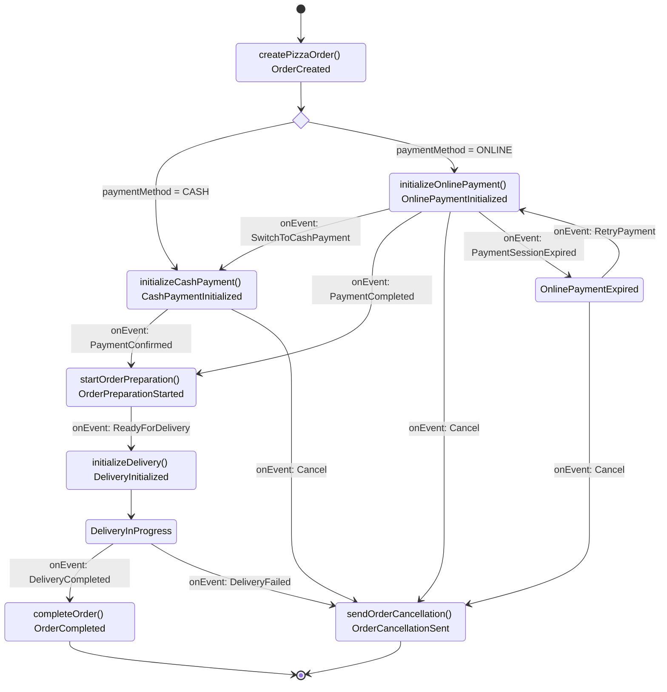

# FlowLite

FlowLite is a lightweight, developer-friendly workflow engine for Kotlin that makes defining business processes intuitive and maintainable. It provides a fluent API for defining process flows that are both easy to code and easy to understand.

## Why FlowLite?

Traditional business process management (BPM) solutions like Camunda are powerful but can be complex and heavyweight. FlowLite offers:

- **Developer-first approach**: Designed with Kotlin developers in mind
- **Type-safe fluent API**: Leverage Kotlin's type system to create robust workflows
- **Visual representation**: Automatically generates diagrams from your code
- **Minimal learning curve**: Natural syntax that reads like plain English
- **Customizable**: Easy to integrate with your existing codebase
- **Composable**: Build complex flows from smaller, reusable pieces
- **Lightweight**

## TODO

* ✅ Prepare a gradle project for Kotlin for this library
* ✅ Prepare rules files for copilot
* ✅ Come up with Kotlin API (I can use it as a client)
* ✅ Put source code into github
* ✅ FlowEngine should not be PizzaOrder specific
* Apply rectangle formatting
* Review API
  * end should return parent flowbuilder?
  * should onEvent return EventBuilder or new flow builder?
* Update pizza order flow
* Implement API to the point that next step is possible 
* Diagram generator and flow validator
* Iterate on the API design
  * engine provides process data to actions or actions do it on their own?
  * consider data persistence including status
* Implementation of the engine
* History of changes

## Process Example

### Assumptions

* Rectangle represent action (methods on diagram) with a state change or state change alone: Format: `actionName() STATE_NAME`
* Status change is executed within the same transaction with action
* When action fails state will be marked as error (not shown diagram).
    * It's possible to add retry strategy for each action.
* Arrows represent transitions between states, triggered by action completion (and status change) or events
* Choice nodes represent routing decisions
* Events can trigger action execution and status change. They represent external triggers that change the process state (e.g., `onEvent: SwitchToCashPayment`)
* Terminal states are represented by transitions to *`[]`

### Diagram

## Code example

See [PizzaDomain.kt](test/PizzaDomain.kt) and [PizzaOrderFlowTest.kt](test/PizzaOrderFlowTest.kt)
