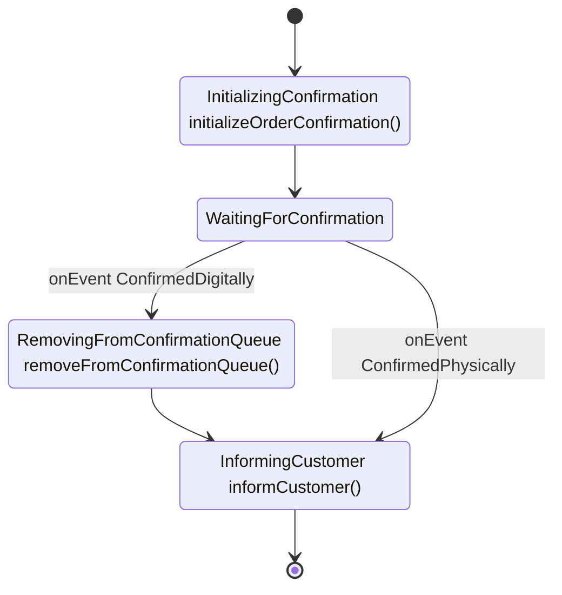
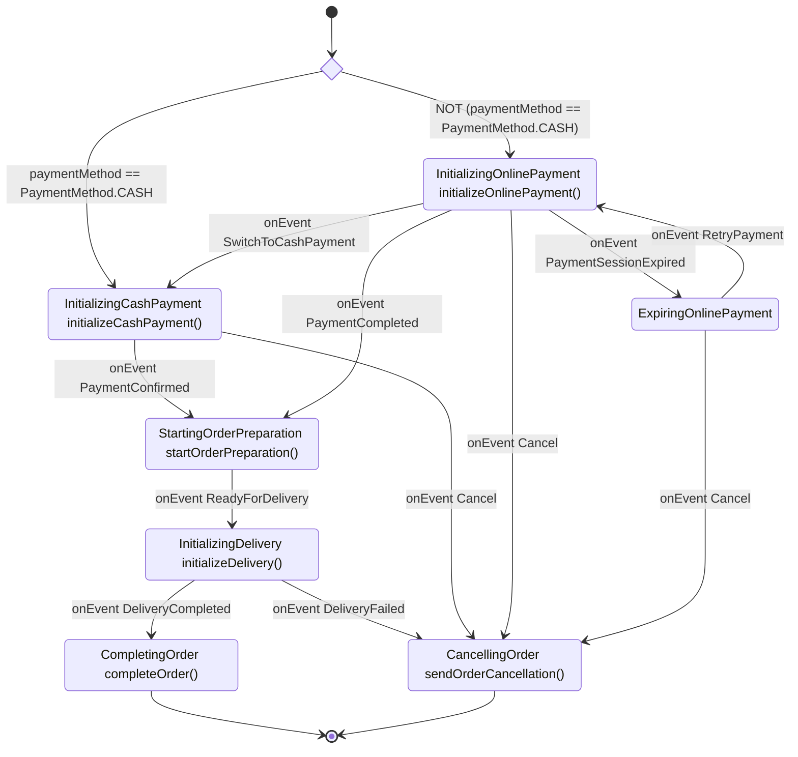
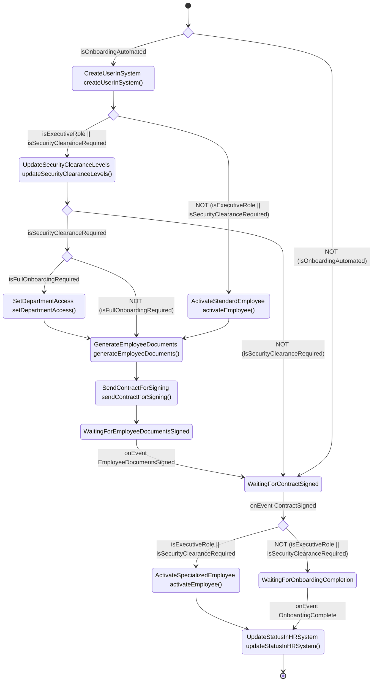

# FlowLite

FlowLite is a lightweight, developer-friendly workflow engine for Kotlin to define business processes in an intuitive and maintainable way. It provides a fluent, type-safe API that stays close to domain language while remaining simple to reason about.

## Table of Contents
1. Why FlowLite?
2. Example flow
3. Key concepts
4. Assumptions & status
5. More examples (auto-generated)
6. Core Architecture
7. Diagram Generation
8. Error Handling
9. Stage Transitions
10. Conditional Branching & Joins
11. Development Guide
12. Code Documentation Guidelines

## Why FlowLite?

Traditional BPM platforms (e.g. Camunda) are powerful but often heavyweight for code-centric teams.

FlowLite at a glance:
- **Type-safe fluent API** – Kotlin-first (enums + functions)
- **Visuals from code** – Mermaid diagrams generated automatically
- **Natural syntax** – Reads close to business intent
- **Lightweight** – Minimal surface area, no BPMN modeling overhead

## Example flow

<!-- FlowDoc(order-confirmation) -->
```kotlin
fun createOrderConfirmationFlow(): Flow<OrderConfirmation> {
    return FlowBuilder<OrderConfirmation>()
        .stage(InitializingConfirmation, ::initializeOrderConfirmation)
        .stage(WaitingForConfirmation)
        .apply {
            waitFor(OrderConfirmationEvent.ConfirmedDigitally)
                .stage(RemovingFromConfirmationQueue, ::removeFromConfirmationQueue)
                .stage(InformingCustomer, ::informCustomer)
            waitFor(ConfirmedPhysically).join(InformingCustomer)
        }
        .end()
        .build()
}
```



<!-- FlowDoc.end -->

## Key concepts and assumptions

- **Stage**: A named step (implements `Stage`, usually enum). Represents “we are doing X” - activity-oriented naming (e.g. `InitializingPayment`).
- **Action**: Function executed when entering a stage `.stage(InitializingConfirmation, ::initializeOrderConfirmation)` (optional).
- **Event**: External trigger causing a transition (implements `Event`).
- **Condition**: Binary branching with a predicate -> true/false branch (renders as a choice node).
- **Join**: Converges control flow by pointing to an existing stage.
- **Flow**: Immutable definition produced by `FlowBuilder<T>.build()`.
- Code-first definitions -> diagrams are derived artifacts.
- Mermaid diagram semantics: rectangle = stage (+ optional action); choice node = condition; `[*]` = terminal.
- StageStatus enum (PENDING, IN_PROGRESS, COMPLETED, ERROR) //TODO: this and next points mark as todo. Maybe some emoji?
- (Stage, StageStatus, retry config) driving next action selection logic
- External message trigger mechanism ("execute next step in flow for instance x")
- Retry semantics & cockpit UI for technical replays
- `BusinessException` marker + differentiated retry UX

## More examples

The examples below are generated from test flows. Each flow builder is wrapped with
`// FLOW-DEFINITION-START` and `// FLOW-DEFINITION-END` markers in its test file.
To document a new flow, add it to the `documentedFlows` list in
`test/ReadmeUpdater.kt` with its id, title, source file path and factory
function.

<!-- FlowDoc(all) -->
### Pizza Order

```kotlin
fun createPizzaOrderFlow(): Flow<PizzaOrder> {

    // Define main pizza order flow
    return FlowBuilder<PizzaOrder>()
        .condition(
            predicate = { it.paymentMethod == PaymentMethod.CASH },
            onTrue = {
                stage(InitializingCashPayment, ::initializeCashPayment).apply {
                    waitFor(PaymentConfirmed)
                        .stage(StartingOrderPreparation, ::startOrderPreparation)
                        .waitFor(ReadyForDelivery)
                        .stage(InitializingDelivery, ::initializeDelivery)
                        .apply {
                            waitFor(DeliveryCompleted).stage(CompletingOrder, ::completeOrder).end()
                            waitFor(DeliveryFailed).stage(CancellingOrder, ::sendOrderCancellation).end()
                        }
                    waitFor(Cancel).join(CancellingOrder)
                }
            },
            onFalse = {
                stage(InitializingOnlinePayment, ::initializeOnlinePayment).apply {
                    waitFor(PaymentCompleted).join(StartingOrderPreparation)
                    waitFor(SwitchToCashPayment).join(InitializingCashPayment)
                    waitFor(Cancel).join(CancellingOrder)
                    waitFor(PaymentSessionExpired).stage(ExpiringOnlinePayment).apply {
                        waitFor(RetryPayment).join(InitializingOnlinePayment)
                        waitFor(Cancel).join(CancellingOrder)
                    }
                }
            },
            description = "paymentMethod == PaymentMethod.CASH"
        )
        .build()
}
```



### Employee Onboarding

```kotlin
fun createEmployeeOnboardingFlow(): Flow<EmployeeOnboarding> {
    return FlowBuilder<EmployeeOnboarding>()
        .condition(
            predicate = { it.isOnboardingAutomated },
            description = "isOnboardingAutomated",
            onTrue = {
                // Automated path
                stage(CreateUserInSystem, ::createUserInSystem)
                    .condition( { it.isExecutiveRole || it.isSecurityClearanceRequired },
                        description = "isExecutiveRole || isSecurityClearanceRequired",
                        onFalse = {
                            stage(ActivateStandardEmployee, ::activateEmployee)
                                .stage(GenerateEmployeeDocuments, ::generateEmployeeDocuments)
                                .stage(SendContractForSigning, ::sendContractForSigning)
                                .stage(WaitingForEmployeeDocumentsSigned)
                                .waitFor(EmployeeDocumentsSigned)
                                .stage(WaitingForContractSigned)
                                .waitFor(ContractSigned, condition = {it.isContractSigned})
                                .condition({ it.isExecutiveRole || it.isSecurityClearanceRequired },
                                    description = "isExecutiveRole || isSecurityClearanceRequired",
                                    onTrue = {
                                        stage(ActivateSpecializedEmployee, ::activateEmployee)
                                            .stage(UpdateStatusInHRSystem, ::updateStatusInHRSystem) },
                                    onFalse = {
                                        stage(WaitingForOnboardingCompletion).waitFor(OnboardingComplete).join(UpdateStatusInHRSystem)}
                                ) },
                        onTrue = {
                            stage(UpdateSecurityClearanceLevels, ::updateSecurityClearanceLevels)
                                .condition( {it.isSecurityClearanceRequired },
                                    description = "isSecurityClearanceRequired",
                                    onTrue = {condition ({it.isFullOnboardingRequired},
                                        description = "isFullOnboardingRequired",
                                        onTrue = {stage(SetDepartmentAccess, ::setDepartmentAccess).join(GenerateEmployeeDocuments)},
                                        onFalse = {join(GenerateEmployeeDocuments)})},
                                    onFalse = {join(WaitingForContractSigned)})
                        })
            },
            onFalse = {
                // Manual path
                join(WaitingForContractSigned)
            }
        )
        .build()
}
```



### Order Confirmation

```kotlin
fun createOrderConfirmationFlow(): Flow<OrderConfirmation> {
    return FlowBuilder<OrderConfirmation>()
        .stage(InitializingConfirmation, ::initializeOrderConfirmation)
        .stage(WaitingForConfirmation)
        .apply {
            waitFor(OrderConfirmationEvent.ConfirmedDigitally)
                .stage(RemovingFromConfirmationQueue, ::removeFromConfirmationQueue)
                .stage(InformingCustomer, ::informCustomer)
            waitFor(ConfirmedPhysically).join(InformingCustomer)
        }
        .end()
        .build()
}
```


<!-- FlowDoc.end -->

## Core Architecture

### Flow Definition System (`source/flowApi.kt`)
- `FlowBuilder<T>` - Fluent API for defining workflows
- `StageBuilder<T>` - Builder for individual stages within flows
- `EventBuilder<T>` - Builder for event-based transitions
- `Flow<T>` - Immutable flow definition container

### Core Interfaces
- `Stage` - Enum-based stage definitions (action-oriented naming)
- `Event` - Enum-based event definitions for transitions
- `StatePersister<T>` - Interface for persisting workflow state

### Flow Components
- `StageDefinition<T>` - Contains stage action, event handlers, condition handler, and next stage
- `ConditionHandler<T>` - Handles conditional branching
- `EventHandler<T>` - Handles event-based transitions
- `FlowEngine` - Runtime engine for executing flows

### Diagram Generation (`source/MermaidGenerator.kt`)
- `MermaidGenerator` - Converts flow definitions to Mermaid diagrams


### Stage Transitions

FlowLite supports 2 types of stage transitions:

1. **Automatic Progression**: Sequential stages automatically flow to the next stage
   ```kotlin
   flow
       .stage(InitializingConfirmation, ::initializeOrderConfirmation)
       .stage(WaitingForConfirmation) // Automatic progression
   ```

2. **Event-Based Transitions**: Explicit events trigger transitions
   ```kotlin
   flow.onEvent(PaymentConfirmed).stage(ProcessingPayment, ::processPayment)
   ```

### Conditional Branching
   ```kotlin
   flow.condition(
       predicate = { it.paymentMethod == PaymentMethod.CASH },
       onTrue = { /* cash flow */ },
       onFalse = { /* online flow */ }
   )
   ```
### Join Operations

Reference existing stages from other branches
   ```kotlin
   flow.onEvent(PaymentCompleted).join(ProcessingOrder)
   ```

## Development Guide

### Windows Setup

If you're cloning this repository on Windows, symbolic links (like `CLAUDE.md -> README.md`) require special Git configuration:

**Option 1: Enable symlinks globally (recommended)**
```bash
git config --global core.symlinks true
git clone <repository-url>
```

**Option 2: Clone with symlinks enabled**
```bash
git clone -c core.symlinks=true <repository-url>
```

**Requirements:** Git for Windows 2.10.2+, NTFS file system, and either Developer Mode enabled or Administrator privileges.

If symbolic links don't work, `CLAUDE.md` will appear as a text file containing "README.md" - in this case, just refer to README.md directly.

### Build and Test Commands
- `./gradlew build` - Build the entire project
- `./gradlew test` - Run all tests
- `./gradlew clean` - Clean build artifacts
- `./gradlew check` - Run all verification tasks

### Code Structure

FlowLite uses a **flat directory structure** to keep the codebase simple and organized:

- `source/` - All main source code (flat structure, no subdirectories for main package)
- `test/` - All test code (flat structure)
- Resources are placed directly in source directory alongside code files, not in a separate resources directory

### Development Notes
- Uses Kotlin 2.1 with Java 21 toolchain
- Kotest for testing with BehaviorSpec style and MockK for mocking
- Gradle build system with Maven publishing configuration

### Code Documentation Guidelines
- Keep the code self-explanatory through clear naming and structure
- Favor clear naming over comments
- Comment only non-obvious cases or complex logic
- Keep architectural & usage docs in this README
