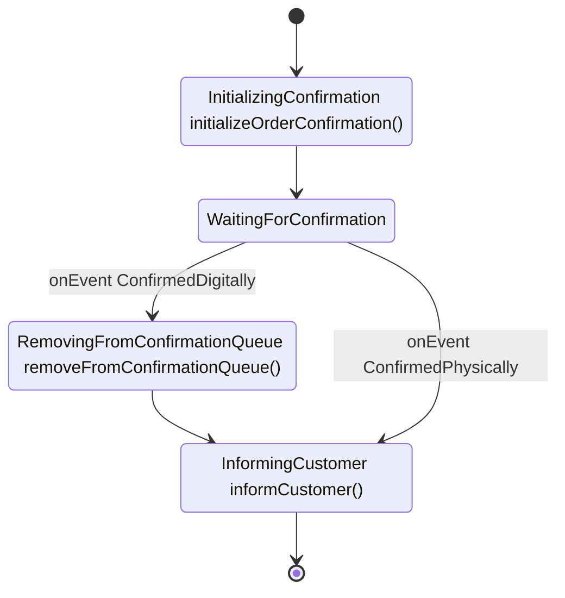

# FlowLite

FlowLite is a lightweight, developer-friendly workflow engine for Kotlin to define business processes in intuitive and maintainable way. 
It provides a fluent API for defining process flows that are both easy to code and easy to understand.

## Table of Contents

//TODO: create table of contents

## Why FlowLite?

Traditional business process management (BPM) solutions like Camunda are powerful but also complex and heavyweight.
FlowLite offers: //TODO: strengths instead of offers?

- **Type-safe fluent API**: Leverage Kotlin's type system and language features to create robust workflows
- **Visual representation**: Automatically generates diagrams from your code
- **Minimal learning curve**: Natural syntax that reads like plain English
- **Lightweight**

## Example flow

<!-- FlowDoc(orderConfirmation) -->

```kotlin
    return FlowBuilder<OrderConfirmation>()
        .stage(InitializingConfirmation, ::initializeOrderConfirmation)
        .stage(WaitingForConfirmation)
        .apply {
            waitFor(OrderConfirmationEvent.ConfirmedDigitally)
                .stage(RemovingFromConfirmationQueue, ::removeFromConfirmationQueue)
                .stage(InformingCustomer, ::informCustomer)
            waitFor(ConfirmedPhysically).join(InformingCustomer)
        }
        .end()
        .build()
```



<!-- FlowDoc.end -->

## Assumptions //TODO: better name for chapter then Assumptions?

* FlowLite uses an Activity-Oriented approach for stages, where stage names indicate ongoing activities (e.g., "InitializingPayment") //TODO: explain also what a stage, and what is action, better use word activity or action?
* Each stage has an associated StageStatus e.g. (PENDING, IN_PROGRESS, COMPLETED, ERROR)
* The combination of Stage and StageStatus (and retry configuration) fully defines what the engine should do next
* Execution of the next step in the flow is triggered by the "execute next step in flow for instance x" message
* Assumptions for mermaid diagrams
  * The Rectangle represents stages with their associated actions. Format: StageName `actionName()`
  * Arrows represent transitions between stages, triggered by action completion or events
  * Choice nodes represent routing decisions
  * Events triggers stage transitions. They represent external triggers that change the process stage (e.g., `onEvent SwitchToCashPayment`)
  * Terminal stages are represented by transitions to `[*]`

## More Examples

The examples below are generated from test flows. Each flow builder is wrapped with
`// FLOW-DEFINITION-START` and `// FLOW-DEFINITION-END` markers in its test file.
To document a new flow, add it to the `documentedFlows` list in
`test/ReadmeUpdater.kt` with its id, title, source file path and factory
function.

<!-- FlowDoc(all) -->
<!-- FlowDoc.end -->

## Core Architecture

### Flow Definition System (`source/flowApi.kt`)
- `FlowBuilder<T>` - Fluent API for defining workflows
- `StageBuilder<T>` - Builder for individual stages within flows
- `EventBuilder<T>` - Builder for event-based transitions
- `Flow<T>` - Immutable flow definition container

### Core Interfaces
- `Stage` - Enum-based stage definitions (action-oriented naming)
- `Event` - Enum-based event definitions for transitions
- `StatePersister<T>` - Interface for persisting workflow state

### Flow Components
- `StageDefinition<T>` - Contains stage action, event handlers, condition handler, and next stage
- `ConditionHandler<T>` - Handles conditional branching
- `EventHandler<T>` - Handles event-based transitions
- `FlowEngine` - Runtime engine for executing flows

### Diagram Generation (`source/MermaidGenerator.kt`)
- `MermaidGenerator` - Converts flow definitions to Mermaid diagrams

### Error Handling

* FlowLite differentiates between two types of exceptions:
  * **Process Exceptions**: Unexpected errors that represent technical issues (e.g. database connection failures, bug in the process action code)
  * **Business Exceptions**: Expected exceptions that represent valid business cases (payment declined, validation errors) (those which implements `BusinessException` marker interface)
* Process exceptions can be retried via the FlowLite cockpit (accessible by technical stuff only)
* Business exceptions meant to be retried via FlowLite api (which you can use when you build your own UI to show process status) but also via FlowLite cockpit.

### Stage Transitions

FlowLite supports 2 types of stage transitions:

1. **Automatic Progression**: Sequential stages automatically flow to the next stage
   ```kotlin
   flow
       .stage(InitializingConfirmation, ::initializeOrderConfirmation)
       .stage(WaitingForConfirmation) // Automatic progression
   ```

2. **Event-Based Transitions**: Explicit events trigger transitions
   ```kotlin
   flow.onEvent(PaymentConfirmed).stage(ProcessingPayment, ::processPayment)
   ```

### Conditional Branching
   ```kotlin
   flow.condition(
       predicate = { it.paymentMethod == PaymentMethod.CASH },
       onTrue = { /* cash flow */ },
       onFalse = { /* online flow */ }
   )
   ```
### Join Operations

Reference existing stages from other branches
   ```kotlin
   flow.onEvent(PaymentCompleted).join(ProcessingOrder)
   ```

## Development Guide

### Windows Setup

If you're cloning this repository on Windows, symbolic links (like `CLAUDE.md -> README.md`) require special Git configuration:

**Option 1: Enable symlinks globally (recommended)**
```bash
git config --global core.symlinks true
git clone <repository-url>
```

**Option 2: Clone with symlinks enabled**
```bash
git clone -c core.symlinks=true <repository-url>
```

**Requirements:** Git for Windows 2.10.2+, NTFS file system, and either Developer Mode enabled or Administrator privileges.

If symbolic links don't work, `CLAUDE.md` will appear as a text file containing "README.md" - in this case, just refer to README.md directly.

### Build and Test Commands
- `./gradlew build` - Build the entire project
- `./gradlew test` - Run all tests
- `./gradlew clean` - Clean build artifacts
- `./gradlew check` - Run all verification tasks

### Code Structure

FlowLite uses a **flat directory structure** to keep the codebase simple and organized:

- `source/` - All main source code (flat structure, no subdirectories for main package)
- `test/` - All test code (flat structure)
- Resources are placed directly in source directory alongside code files, not in a separate resources directory

### Development Notes
- Uses Kotlin 2.1 with Java 21 toolchain
- Kotest for testing with BehaviorSpec style and MockK for mocking
- Gradle build system with Maven publishing configuration

### Code Documentation Guidelines
- **Avoid documentation in code** - Code should be self-explanatory through clear naming and structure
- **Documentation is an exception** - Only add code comments for non-obvious cases or complex logic
- **Prefer README over code docs** - Document architecture, design decisions, and usage patterns in README.md
- **Clear naming over comments** - Use descriptive function/variable names instead of explanatory comments