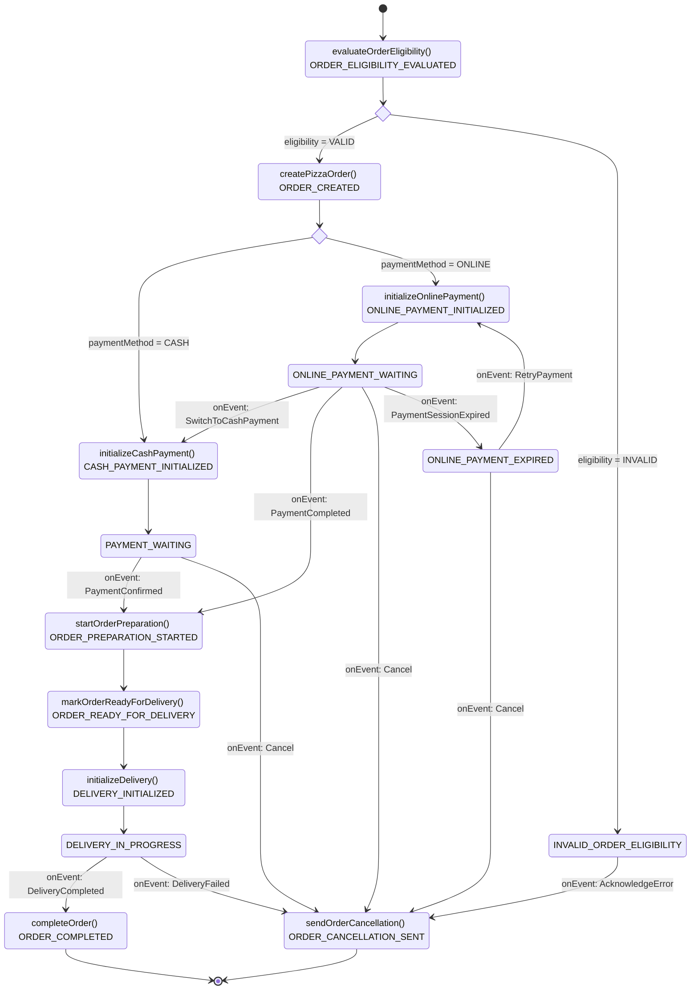

# FlowLite

FlowLite is a lightweight, developer-friendly workflow engine for Kotlin that makes defining business processes intuitive and maintainable. It provides a fluent API for defining process flows that are both easy to code and easy to understand.

## Why FlowLite?

Traditional business process management (BPM) solutions like Camunda are powerful but can be complex and heavyweight. FlowLite offers:

- **Developer-first approach**: Designed with Kotlin developers in mind
- **Type-safe fluent API**: Leverage Kotlin's type system to create robust workflows
- **Visual representation**: Automatically generates diagrams from your code
- **Minimal learning curve**: Natural syntax that reads like plain English
- **Customizable**: Easy to integrate with your existing codebase
- **Composable**: Build complex flows from smaller, reusable pieces
- **Lightweight**

## TODO

* ✅ Prepare a gradle project for Kotlin for this library
* ✅ Prepare rules files for copilot
* ✅ Come up with Kotlin API (I can use it as a client)
* Put source code into github
* Full implementation of API
* Diagram generator and flow validator
* Implementation of the engine

## Process Example

### Assumptions

* Rectangle represent action (methods on diagram) with a state change or state change alone: Format: `actionName() STATE_NAME`
* Status change is executed within the same transaction with action
* When action fails state will be marked as error (not shown diagram).
    * It's possible to add retry strategy for each action.
* Arrows represent transitions between states, triggered by action completion (and status change) or events
* Choice nodes represent routing decisions
* Events can trigger action execution and status change. They represent external triggers that change the process state (e.g., `onEvent: SwitchToCashPayment`)
* Terminal states are represented by transitions to *`[]`

### Diagram



## Code

```
// Define only reused actions
object OrderActions {
    // The cancel order action is used in multiple places
    val cancelOrder = ActionWithStatus<PizzaOrder> { 
        order, _ -> 
        order.sendOrderCancellation()
        OrderStatus.ORDER_CANCELLATION_SENT
    }
    
    // Online payment initialization is used in two places
    val initializeOnlinePayment = ActionWithStatus<PizzaOrder> { 
        order, _ -> 
        order.initializeOnlinePayment()
        OrderStatus.ONLINE_PAYMENT_WAITING
    }
    
    // With retry version
    val initializeOnlinePaymentWithRetry = ActionWithStatus<PizzaOrder>(
        action = { order, _ -> 
            order.initializeOnlinePayment()
            OrderStatus.ONLINE_PAYMENT_WAITING
        },
        retry = RetryStrategy(
            maxAttempts = 3,
            delayMs = 1000,
            exponentialBackoff = true,
            retryOn = setOf(PaymentGatewayException::class)
        )
    )
}

// Define main process flow using inline actions for one-off cases
// and reusable actions for repeated patterns
val pizzaOrderFlow = FlowBuilder<PizzaOrder>(OrderStatus.CREATED)
    .doAction(
        action = { order, _ -> order.evaluateOrderEligibility() },
        resultStatus = OrderStatus.ORDER_ELIGIBILITY_EVALUATED
    )
    
    // Check eligibility condition
    .condition { order -> order.eligibility == Eligibility.VALID }
        .onTrue()
            .doAction(
                action = { order, _ -> order.createPizzaOrder() },
                resultStatus = OrderStatus.ORDER_CREATED
            )
            
            // Check payment method
            .condition { order -> order.paymentMethod == PaymentMethod.CASH }
                .onTrue()
                    .subFlow(cashPaymentFlow)
                .onFalse()
                    .subFlow(onlinePaymentFlow)
        .onFalse()
            .transitionTo(OrderStatus.INVALID_ORDER_ELIGIBILITY)
            .onEvent(OrderEvent.ACKNOWLEDGE_ERROR)
                .doAction(OrderActions.cancelOrder) // Reused action
                .end()

// Cash payment subflow
val cashPaymentFlow = FlowBuilder<PizzaOrder>(OrderStatus.CASH_PAYMENT_INITIALIZED)
    .doAction(
        action = { order, _ -> order.initializeCashPayment() },
        resultStatus = OrderStatus.PAYMENT_WAITING
    )
    
    // Handle different events for payment waiting
    .onEvent(OrderEvent.PAYMENT_CONFIRMED)
        .subFlow(orderPreparationFlow)
    
    .onEvent(OrderEvent.CANCEL)
        .doAction(OrderActions.cancelOrder) // Reused action
        .end()

// Online payment subflow
val onlinePaymentFlow = FlowBuilder<PizzaOrder>(OrderStatus.ONLINE_PAYMENT_INITIALIZED)
    .doAction(OrderActions.initializeOnlinePayment) // Reused action
    
    // Handle different events for online payment
    .onEvent(OrderEvent.PAYMENT_COMPLETED)
        .subFlow(orderPreparationFlow)
    
    .onEvent(OrderEvent.SWITCH_TO_CASH_PAYMENT)
        .subFlow(cashPaymentFlow)
    
    .onEvent(OrderEvent.CANCEL)
        .doAction(OrderActions.cancelOrder) // Reused action
        .end()
    
    .onEvent(OrderEvent.PAYMENT_SESSION_EXPIRED)
        .transitionTo(OrderStatus.ONLINE_PAYMENT_EXPIRED)
        
        .onEvent(OrderEvent.RETRY_PAYMENT)
            .doAction(OrderActions.initializeOnlinePayment) // Reused action
            .goTo(onlinePaymentFlow)
        
        .onEvent(OrderEvent.CANCEL)
            .doAction(OrderActions.cancelOrder) // Reused action
            .end()

// Order preparation subflow
val orderPreparationFlow = FlowBuilder<PizzaOrder>(OrderStatus.ORDER_PREPARATION_STARTED)
    .doAction(
        action = { order, _ -> order.startOrderPreparation() },
        resultStatus = OrderStatus.ORDER_READY_FOR_DELIVERY
    )
    
    .doAction(
        action = { order, _ -> order.markOrderReadyForDelivery() },
        resultStatus = OrderStatus.DELIVERY_INITIALIZED
    )
    
    .subFlow(deliveryFlow)

// Delivery subflow
val deliveryFlow = FlowBuilder<PizzaOrder>(OrderStatus.DELIVERY_INITIALIZED)
    .doAction(
        action = { order, _ -> order.initializeDelivery() },
        resultStatus = OrderStatus.DELIVERY_IN_PROGRESS
    )
    
    .onEvent(OrderEvent.DELIVERY_COMPLETED)
        .doAction(
            action = { order, _ -> order.completeOrder() },
            resultStatus = OrderStatus.ORDER_COMPLETED
        )
        .end()
    
    .onEvent(OrderEvent.DELIVERY_FAILED)
        .doAction(OrderActions.cancelOrder) // Reused action
        .end()

// Registration with flow engine
val flowEngine = FlowEngine<PizzaOrder>()
flowEngine.registerFlow("pizza-order", pizzaOrderFlow)
```