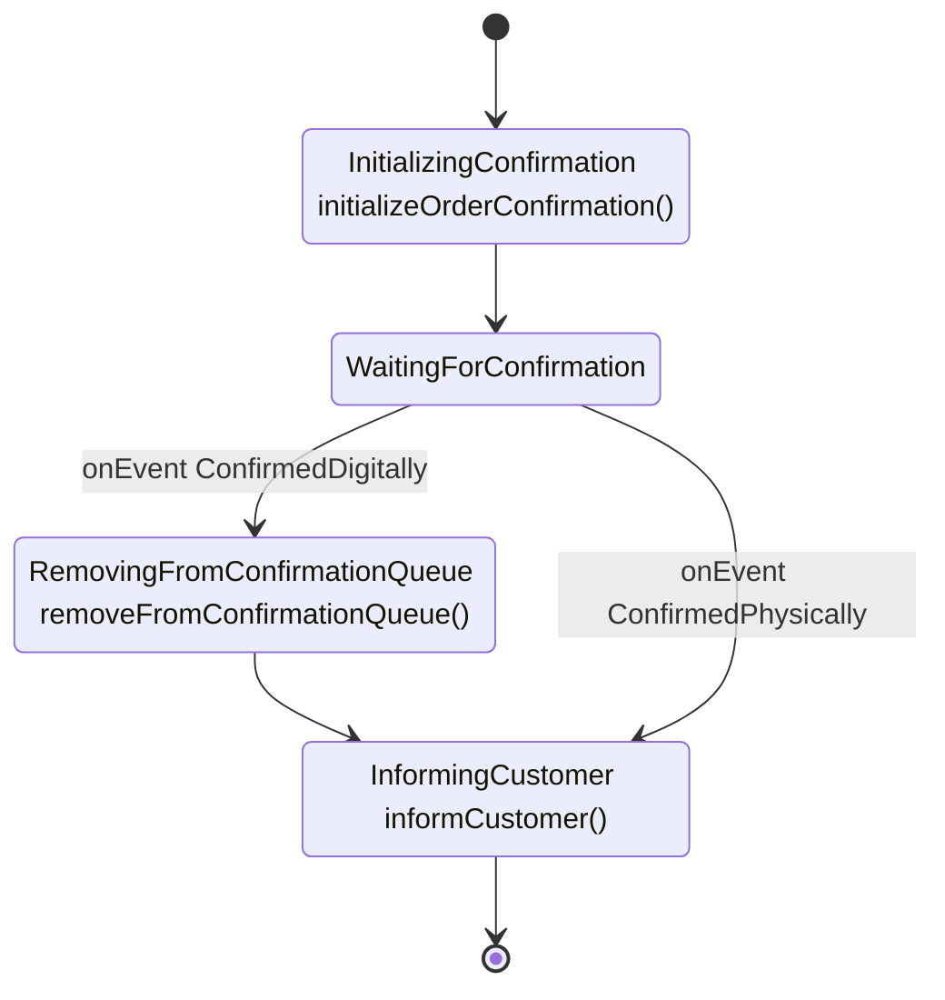
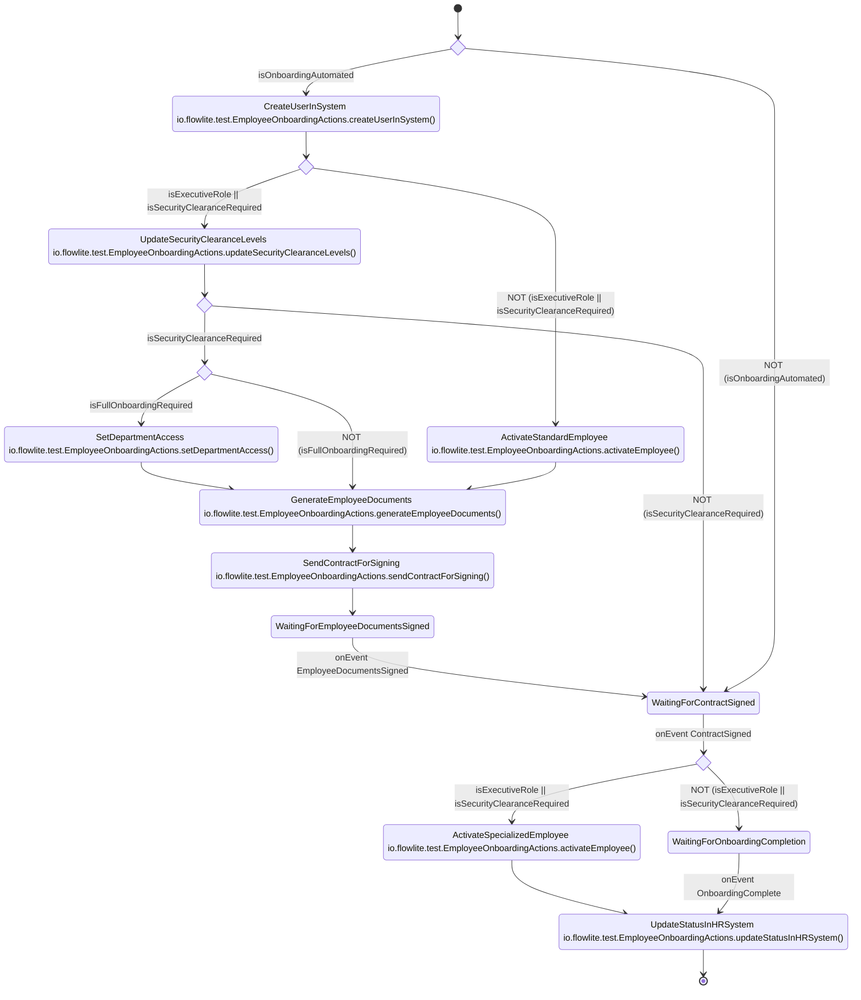

# FlowLite

FlowLite is a lightweight, developer-friendly workflow engine for Kotlin to define business processes in an intuitive and maintainable way. It provides a fluent, type-safe API that stays close to domain language while remaining simple to reason about.

Note: FlowLite is actively evolving. Breaking changes may be introduced and backwards compatibility is not considered for now.

## Table of Contents
- [Why FlowLite?](#why-flowlite)
- [Example flow](#example-flow)
- [Key concepts and assumptions](#key-concepts-and-assumptions)
- [Stage Transitions](#stage-transitions)
- [Conditional Branching](#conditional-branching)
- [Join Operations](#join-operations)
- [More examples](#more-examples)
  - [Employee Onboarding](#employee-onboarding)
  - [Order Confirmation](#order-confirmation)
- [Core Architecture](#architecture)
    - [Runtime & Execution Model](#runtime--execution-model)
    - [Transaction Boundaries](#transaction-boundaries)
    - [Persistence Approach](#persistence-approach)
    - [Contracts](#contracts)
      - [Practical schema guidance (JDBC)](#practical-schema-guidance-jdbc)
    - [Engine API](#engine-api)
    - [Deferred / Future Enhancements](#deferred--future-enhancements)
  - [Flow Definition System](#flow-definition-system-sourceflowapikt)
  - [Core Interfaces](#core-interfaces)
  - [Flow Components](#flow-components)
  - [Diagram Generation](#diagram-generation-sourcemermaidgeneratorkt)
- [Development Guide](#development-guide)
  - [Windows Setup](#windows-setup)
  - [Build and Test Commands](#build-and-test-commands)
  - [Code Structure](#code-structure)
  - [Development Notes](#development-notes)
- [Code Documentation Guidelines](#code-documentation-guidelines)

## Why FlowLite?

Traditional BPM platforms (e.g. Camunda) are powerful but heavyweight for code-centric teams.

FlowLite at a glance:
- **Type-safe fluent API**
- **Visuals from code** – Mermaid diagrams generated automatically
- **Natural syntax** – Reads close to business intent
- **Lightweight**

## Example flow

<!-- FlowDoc(order-confirmation) -->
```kotlin
fun createOrderConfirmationFlow(): Flow<OrderConfirmation> {
    return FlowBuilder<OrderConfirmation>()
        .stage(InitializingConfirmation, ::initializeOrderConfirmation)
        .stage(WaitingForConfirmation)
        .apply {
            waitFor(ConfirmedDigitally)
                .stage(RemovingFromConfirmationQueue, ::removeFromConfirmationQueue)
                .stage(InformingCustomer, ::informCustomer)
            waitFor(ConfirmedPhysically).join(InformingCustomer)
        }
        .end()
        .build()
}
```



<!-- FlowDoc.end -->

## Key concepts and assumptions

- **Stage**: A named step (implements `Stage`, usually enum). Represents “we are doing X” - activity-oriented naming (e.g. `InitializingPayment`).
- **Action**: Function executed when entering a stage `.stage(InitializingConfirmation, ::initializeOrderConfirmation)` (optional).
- **Event**: External trigger causing a transition (implements `Event`). Submitted through engine API.
- **Condition**: Binary branching with a predicate -> true/false branch (renders as a choice node).
- **Join**: Converges control flow by pointing to an existing stage
- **Flow**: Immutable definition produced by `FlowBuilder<T>.build()` and held in-memory.
- **StageStatus**: Lifecycle state of the single active stage:
    - `PENDING` – Active stage awaiting action execution or matching event.
    - `RUNNING` – Flow instance is currently being progressed by the engine (claimed via an atomic `PENDING -> RUNNING` transition in persistence). Remains `RUNNING` during the whole processing loop and is released back to `PENDING` when the instance needs to wait for an event.
    - `COMPLETED` – Only used for terminal stages. When a non-terminal stage finishes, the engine advances the pointer to the next stage with `PENDING` rather than persisting completion of the previous stage.
    - `ERROR` – Action failed; requires manual retry.
- **Tick**: An internal “work item / wake-up signal” that tells the engine “try to make progress for (flowId, flowInstanceId) now”.
    - A tick carries no business payload;
    - Ticks are emitted on `startInstance`, `sendEvent`, and `retry`.
- Client that uses FlowLite provides the persistence for both FlowLite specific (id, stage, stage status) and process specific data
- Single-token model: only one active stage at any moment (no parallelism within one flow).
- Code-first definitions -> diagrams are derived artifacts.
- Mermaid diagram semantics: rectangle = stage (+ optional action); choice node = condition; `[*]` = terminal.
- Error handling: any exception marks stage `ERROR`; `retry` resets it back to `PENDING` and restarts from that stage.
- Migration: If the flow changes, migrations of existing instances are the responsibility of the application that uses FlowLite. No flow versioning nor migration support is planned in FlowLite.

### Stage Transitions

FlowLite supports 2 types of stage transitions:

1. **Automatic Progression**: Sequential stages automatically flow to the next stage
   ```kotlin
   flow
       .stage(InitializingConfirmation, ::initializeOrderConfirmation)
       .stage(WaitingForConfirmation) // Automatic progression
   ```

2. **Event-Based Transitions**: Explicit events trigger transitions
   ```kotlin
   flow.waitFor(PaymentConfirmed).stage(ProcessingPayment, ::processPayment)
   ```

Event waiting semantics (`waitFor`):
- A stage that calls `waitFor(EventX)` will transition when `EventX` is received.
- If `EventX` was emitted earlier (before the workflow reached this stage), it is persisted and delivered immediately when the stage is entered.

### Conditional Branching
   ```kotlin
   flow.condition(
       predicate = { it.paymentMethod == PaymentMethod.CASH },
       onTrue = { /* true flow */ },
       onFalse = { /* false flow */ }
   )
   ```
### Join Operations

Reference already defined stages using `join()`:
   ```kotlin
   flow.waitFor(PaymentCompleted).join(ProcessingOrder)
   ```

### Action functions

- Signature: `(state: T) -> T?`
    - Return a new instance to persist domain changes and proceed.
    - Return `null` to indicate no domain changes; the engine will still persist the stage/status transition and proceed.
- Guidelines:
    - Keep actions small and focused.
  
## More examples

The examples below are generated from test flows. Each flow builder is wrapped with
`// FLOW-DEFINITION-START` and `// FLOW-DEFINITION-END` markers in its test file.
To document a new flow, add it to the `documentedFlows` list in
`test/ReadmeUpdater.kt` with its id, title, source file path and factory
function.

Documentation refresh:
- The GitHub Action `.github/workflows/update-readme.yml` regenerate all flow code examples and Mermaid diagrams between the `FlowDoc` markers on pushes and commits the update
- Run `./gradlew updateReadme` if you want to run it locally

<!-- FlowDoc(all) -->
### Employee Onboarding

```kotlin
        FlowBuilder<EmployeeOnboarding>()
            .condition(
                predicate = { it.isOnboardingAutomated },
                description = "isOnboardingAutomated",
                onTrue = {
                    // Automated path
                    stage(CreateUserInSystem, actions::createUserInSystem)
                        .condition(
                            { it.isExecutiveRole || it.isSecurityClearanceRequired },
                            description = "isExecutiveRole || isSecurityClearanceRequired",
                            onFalse = {
                                stage(ActivateStandardEmployee, actions::activateEmployee)
                                    .stage(GenerateEmployeeDocuments, actions::generateEmployeeDocuments)
                                    .stage(SendContractForSigning, actions::sendContractForSigning)
                                    .stage(WaitingForEmployeeDocumentsSigned)
                                    .waitFor(EmployeeDocumentsSigned)
                                    .stage(WaitingForContractSigned)
                                    .waitFor(ContractSigned)
                                    .condition(
                                        { it.isExecutiveRole || it.isSecurityClearanceRequired },
                                        description = "isExecutiveRole || isSecurityClearanceRequired",
                                        onTrue = {
                                            stage(ActivateSpecializedEmployee, actions::activateEmployee)
                                                .stage(UpdateStatusInHRSystem, actions::updateStatusInHRSystem)
                                        },
                                        onFalse = {
                                            stage(WaitingForOnboardingCompletion)
                                                .waitFor(OnboardingComplete)
                                                .join(UpdateStatusInHRSystem)
                                        },
                                    )
                            },
                            onTrue = {
                                stage(UpdateSecurityClearanceLevels, actions::updateSecurityClearanceLevels)
                                    .condition(
                                        { it.isSecurityClearanceRequired },
                                        description = "isSecurityClearanceRequired",
                                        onTrue = {
                                            condition(
                                                { it.isFullOnboardingRequired },
                                                description = "isFullOnboardingRequired",
                                                onTrue = {
                                                    stage(SetDepartmentAccess, actions::setDepartmentAccess)
                                                        .join(GenerateEmployeeDocuments)
                                                },
                                                onFalse = { join(GenerateEmployeeDocuments) },
                                            )
                                        },
                                        onFalse = { join(WaitingForContractSigned) },
                                    )
                            },
                        )
                },
                onFalse = {
                    // Manual path
                    join(WaitingForContractSigned)
                },
            )
            .build()
```



### Order Confirmation

```kotlin
fun createOrderConfirmationFlow(): Flow<OrderConfirmation> {
    return FlowBuilder<OrderConfirmation>()
        .stage(InitializingConfirmation, ::initializeOrderConfirmation)
        .stage(WaitingForConfirmation)
        .apply {
            waitFor(ConfirmedDigitally)
                .stage(RemovingFromConfirmationQueue, ::removeFromConfirmationQueue)
                .stage(InformingCustomer, ::informCustomer)
            waitFor(ConfirmedPhysically).join(InformingCustomer)
        }
        .end()
        .build()
}
```


<!-- FlowDoc.end -->

## Architecture

### Runtime & Execution Model

1. Starting a flow instance persists instance data, calculates initial stage and enqueues a Tick. It's also possible to pre-create the flow instance earlier with your business data and later start processing by providing id.
2. Tick processing loop:
    - Load flow instance state (stage + status) via `StatePersister`.
    - If status `ERROR` → stop (await retry).
    - If status `RUNNING` → another worker currently owns the instance; stop (tick delivered while the instance is already being processed).
    - If status `PENDING`: atomically claim the instance by transitioning `PENDING -> RUNNING` (optimistic CAS in persistence).
    - While `RUNNING`, the engine will keep advancing through automatic transitions and actions.
        - If the current stage waits for events and no matching event exists: release the claim by setting status back to `PENDING`, enqueue a Tick, and stop.
            - Why enqueue: an event may arrive while the instance is `RUNNING` and its Tick can be delivered and ignored; enqueueing after releasing to `PENDING` ensures the event store is re-checked.
        - If the current stage consumes an event: advance to the next stage and continue (staying `RUNNING`).
        - If the current stage executes an action: run it and advance to the next stage and continue (staying `RUNNING`), or mark `COMPLETED` if terminal.
        - On failure: set `ERROR` (best-effort) and stop.
3. External events: `sendEvent(flowId, flowInstanceId, event)` inserts a event into `EventStore` and enqueues a Tick. The Tick will consume the event immediately if the instance is currently waiting for it; otherwise the event remains pending until eligible.

`RUNNING` acts as a single-flight claim for tick processing. If a JVM crashes mid-loop, the instance may remain `RUNNING` until application-defined recovery resets it.

### Transaction Boundaries
FlowLite does not start or manage transactions internally (to remain persistence-agnostic).

Practical guidance (DB-backed implementations):
- `startInstance`: persist the flow instance and enqueue a tick in the same transaction (or via an outbox) to avoid “flow instance created but never scheduled”.
- `sendEvent`: append the pending event and enqueue a tick in the same transaction (or via an outbox) to avoid “event stored but never scheduled”.
- `retry`: update `stage_status` to `PENDING` and enqueue a tick in the same transaction (or via an outbox).
- Tick handling (`processTick`): wrapping it into transaction is not recommended since this will create a big transaction spanning all transition and actions between start and first stage with event handler or terminal state.

### Persistence Approach

FlowLite is “application-owned” for persistence which means you need to provide persistence implementation.
At minimum, an application needs two persistence components:

1. **Flow instance state persistence** (`StatePersister<T>`)
    - Stores domain state **and** engine state for a single flow instance.
    - Required engine fields:
      - `id` (UUID, flow instance id)
      - `stage` (string/enum name)
      - `stage_status` (`PENDING` | `RUNNING` | `ERROR` | `COMPLETED`)
        - Engine fields are **owned by the engine** and must not be updated by external writers.
    - Plus your domain fields (customer data, order data, etc).

2. **Pending events persistence** (`EventStore`)
    - Stores events submitted via `sendEvent` until the flow reaches a stage that can consume them.
    - This is what enables “mailbox semantics”: events can arrive early and will be applied later.

In tests, examples of these integrations live in:
- `StatePersister`: `SpringDataOrderConfirmationPersister`, `SpringDataEmployeeOnboardingPersister`
- `EventStore`: `SpringDataEventStore`

### Contracts

`StatePersister<T>`:
- `load(flowInstanceId)` → current state (including engine fields); throws if the flow instance does not exist
- `save(processData)` → create or update; beside updated engine fields processData may contain domain modifications produced by actions (see action persistence guidance below); returns refreshed data on success.
    - Should be best-effort in the presence of concurrency (optimistic locking): retry and/or merge engine-owned fields (`stage`, `stage_status`) with a freshly loaded domain snapshot to avoid lost updates.
- `tryTransitionStageStatus(flowInstanceId, expectedStage, expectedStatus, newStatus)` → atomic compare-and-set transition of `stage_status` (guarded by both `stage` and `stage_status`). Returns true only if the expected values matched and the update was applied.
    - Used by the engine to claim single-flight processing (`PENDING -> RUNNING`).
    - Implementation options include:
        - Atomic CAS update (e.g. SQL `UPDATE ... WHERE id AND stage AND stage_status`).
        - `load` + check + `save` guarded by optimistic locking (`@Version`) and handling optimistic lock failures.
        - Persist engine state (stage/status) separately from business state.


`(state: T) -> T?` action persistence guidance:
- If an action needs to persist business changes (i.e. has side effects on the process business data), it is recommended that the action persists those changes itself and then returns the updated state to the engine.
- An action may also return updated state without saving and rely on the engine calling `StatePersister.save(...)` for persistence. In this case, the persister must handle concurrency correctly (optimistic locking / merge rules). See the concurrency notes below.
- If the action returns `null` engine will call `StatePersister.save(...)` with last loaded copy (before action execution) of data updated with stage advances

`TickScheduler` contract:
- `setTickHandler(handler)`
    - Called once by the engine during `FlowEngine` initialization to register the function that processes ticks.
- `scheduleTick(flowId, flowInstanceId)`
    - Enqueues a tick for `(flowId, flowInstanceId)`.
    - At-least-once delivery is required; duplicates are allowed.
- Delivery/lifecycle expectations:
    - Schedulers should start delivering already-queued ticks after application startup.
- Error handling:
    - If the tick handler throws, the scheduler should log and continue delivering future ticks (optionally with backoff). It must not crash permanently.

See `test/DbTickScheduler.kt` for a minimal in-process polling scheduler.

Concurrency scenarios (cheat sheet):

| Scenario                                                        | Can it happen? | If unmitigated, what can go wrong?                                                           | Recommended mitigation                                                                                                        |
|-----------------------------------------------------------------|--------------:|----------------------------------------------------------------------------------------------|-------------------------------------------------------------------------------------------------------------------------------|
| Two ticks processed concurrently for same instance              | No (if correctly implemented) | Double action execution; double stage advance; inconsistent state                            | Use an atomic `PENDING -> RUNNING` claim using CAS (`tryTransitionStageStatus(...)`) in persistence                           |
| Duplicate `sendEvent` for same instance + event type            | Yes (retries, double-click, at least once external events) | Extra pending event rows; with FlowLite’s flow-definition validation (event used in only one `waitFor(...)`), duplicates are typically harmless but may accumulate | Optionally add dedup/idempotency to `EventStore` if you care about storage growth                                             |
| External writer updates the same row while engine is processing |                                   Yes (GUI, notifications) | Potential lost updates; optimistic lock conflicts                                            | Options in case of JDBC persistence: 1) use optimistic locking (with merge or retries) 2) move engine state to separate table |


#### Practical schema guidance (JDBC)

No external updates (only process updates the row):
- No issues with keeping engine and business fields in one table (one row per flow instance).
- Optimistic locking not necessary
- Actions can return a new state `T` and the persister can save business + engine fields atomically.

External updates exist (GUI / notifications / other services):
- Option A: Single table; External writers update business fields and handle optimistic lock conflicts with proper merge; persister called by engine handles optimistic lock conflicts with proper merge.
- Option B: Separate table for engine and business fields.

### Engine API

The canonical reference for the API is the code in `source/flowApi.kt`.
This README keeps a short, “semantic” list to explain intent, but the signatures may evolve.

- `registerFlow(flowId, flow, statePersister)`
- `startInstance(flowId, initialState)` – persists initial state and enqueues a Tick
- `startInstance(flowId, flowInstanceId)` – starts processing for an already persisted row
- `sendEvent(flowId, flowInstanceId, event)` – appends a pending event and enqueues a Tick
- `retry(flowId, flowInstanceId)` – if current stage status is `ERROR`, resets it to `PENDING` and enqueues a Tick
- `getStatus(flowId, flowInstanceId)` – returns `(stage, stageStatus)`

### Deferred / Future Enhancements

- Cockpit
- structured audit history with error 
- Distinguish business vs technical errors with tailored retry policies
- Parallelism
- Metrics, tracing

### Flow Definition System (`source/flowApi.kt`)
- `FlowBuilder<T>` - Fluent API for defining workflows
- `StageBuilder<T>` - Builder for individual stages within flows
- `EventBuilder<T>` - Builder for event-based transitions
- `Flow<T>` - Immutable flow definition container

### Core Interfaces
- `Stage` - Enum-based stage definitions (action-oriented naming)
- `Event` - Enum-based event definitions for transitions
- `StatePersister<T>` - Interface for persisting workflow state

### Flow Components
- `StageDefinition<T>` - Contains stage action, event handlers, condition handler, and next stage
- `ConditionHandler<T>` - Handles conditional branching
- `EventHandler<T>` - Handles event-based transitions
- `FlowEngine` - Runtime engine for executing flows
    - Drives progression via internal Tick messages
    - Maintains exactly one active stage per process
    - Uses `StageStatus` to guard action execution and enable idempotent replay
    - External events stored in a shared `pending_events` table and consumed when a matching waiting stage becomes active

### Diagram Generation (`source/MermaidGenerator.kt`)
- `MermaidGenerator` - Converts flow definitions to Mermaid diagrams

## Development Guide

### Windows Setup

If you're cloning this repository on Windows, symbolic links (like `AGENTS.md -> README.md`) require special Git configuration:

**Option 1: Enable symlinks globally (recommended)**
```bash
git config --global core.symlinks true
git clone <repository-url>
```

**Option 2: Clone with symlinks enabled**
```bash
git clone -c core.symlinks=true <repository-url>
```

**Requirements:** Git for Windows 2.10.2+, NTFS file system, and either Developer Mode enabled or Administrator privileges.

If symbolic links don't work, `AGENTS.md` will appear as a text file containing "README.md" - in this case, just refer to README.md directly.

### Build and Test Commands
- `./gradlew build` - Build the entire project
- `./gradlew test` - Run all tests
- `./gradlew clean` - Clean build artifacts
- `./gradlew check` - Run all verification tasks

### Code Structure

FlowLite uses a **flat directory structure** to keep the codebase simple and organized:

- `source/` - All main source code (flat structure, no subdirectories for main package)
- `test/` - All test code (flat structure)
- Resources are placed directly in source directory alongside code files, not in a separate resources directory

### Development Notes
- Uses Kotlin 2.2 with Java 21 toolchain
- Kotest for testing with BehaviorSpec style and MockK for mocking
- Gradle build system with Maven publishing configuration

### Code Documentation Guidelines
- Keep the code self-explanatory through clear naming and structure
- Favor clear naming over comments
- Comment only non-obvious cases or complex logic
- Keep architectural & usage docs in this README
- Remember to update "Table of Contents" in README when adding new chapter or changing existing
