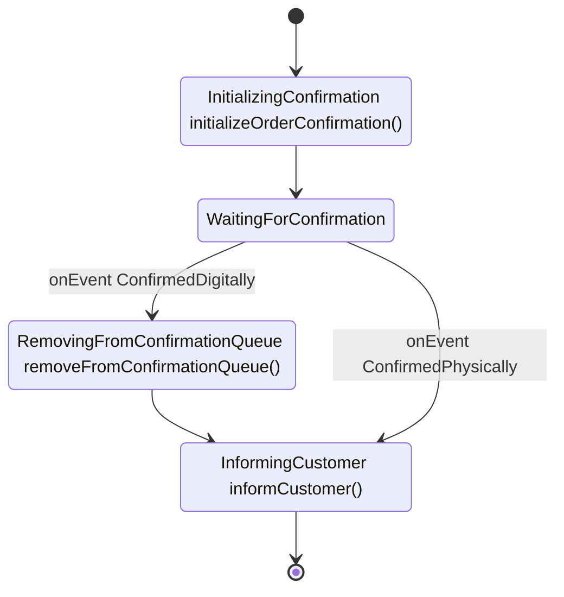

# FlowLite

FlowLite is a lightweight, developer-friendly workflow engine for Kotlin to define business processes in an intuitive and maintainable way. It provides a fluent, type-safe API that stays close to domain language while remaining simple to reason about.

## Table of Contents
- [Why FlowLite?](#why-flowlite)
- [Example flow](#example-flow)
- [Key concepts and assumptions](#key-concepts-and-assumptions)
- [Stage Transitions](#stage-transitions)
- [Conditional Branching](#conditional-branching)
- [Join Operations](#join-operations)
- [More examples](#more-examples)
  - [Pizza Order](#pizza-order)
  - [Employee Onboarding](#employee-onboarding)
  - [Order Confirmation](#order-confirmation)
- [Core Architecture](#core-architecture)
    - [Runtime & Execution Model](#runtime--execution-model)
    - [Transaction Boundaries](#transaction-boundaries)
    - [Persistence Approach](#persistence-approach)
    - [StatePersister Contract](#statepersister-contract)
    - [Engine API](#engine-api)
    - [Idempotency & Crash Safety](#idempotency--crash-safety)
    - [Deferred / Future Enhancements](#deferred--future-enhancements)
  - [Flow Definition System](#flow-definition-system-sourceflowapikt)
  - [Core Interfaces](#core-interfaces)
  - [Flow Components](#flow-components)
  - [Diagram Generation](#diagram-generation-sourcemermaidgeneratorkt)
- [Development Guide](#development-guide)
  - [Windows Setup](#windows-setup)
  - [Build and Test Commands](#build-and-test-commands)
  - [Code Structure](#code-structure)
  - [Development Notes](#development-notes)
- [Code Documentation Guidelines](#code-documentation-guidelines)

## Why FlowLite?

Traditional BPM platforms (e.g. Camunda) are powerful but also heavyweight for code-centric teams.

FlowLite at a glance:
- **Type-safe fluent API** – Kotlin-first (enums + functions)
- **Visuals from code** – Mermaid diagrams generated automatically
- **Natural syntax** – Reads close to business intent
- **Lightweight** – Minimal surface area, no BPMN modeling overhead

## Example flow

<!-- FlowDoc(order-confirmation) -->
```kotlin
fun createOrderConfirmationFlow(): Flow<OrderConfirmation> {
    return FlowBuilder<OrderConfirmation>()
        .stage(InitializingConfirmation, ::initializeOrderConfirmation)
        .stage(WaitingForConfirmation)
        .apply {
            waitFor(OrderConfirmationEvent.ConfirmedDigitally)
                .stage(RemovingFromConfirmationQueue, ::removeFromConfirmationQueue)
                .stage(InformingCustomer, ::informCustomer)
            waitFor(ConfirmedPhysically).join(InformingCustomer)
        }
        .end()
        .build()
}
```



<!-- FlowDoc.end -->

## Key concepts and assumptions

- **Stage**: A named step (implements `Stage`, usually enum). Represents “we are doing X” - activity-oriented naming (e.g. `InitializingPayment`).
- **Action**: Function executed when entering a stage `.stage(InitializingConfirmation, ::initializeOrderConfirmation)` (optional).
- **Event**: External trigger causing a transition (implements `Event`). Submitted through engine API.
- **Condition**: Binary branching with a predicate -> true/false branch (renders as a choice node).
- **Join**: Converges control flow by pointing to an existing stage
- **Flow**: Immutable definition produced by `FlowBuilder<T>.build()` and held in-memory.
- **StageStatus**: Lifecycle state of the single active stage:
    - `PENDING` – Active stage awaiting action execution or matching event.
    - `RUNNING` – Action is currently executing (set before invocation for crash detection).
    - `COMPLETED` – Only used for terminal stages. When a non-terminal stage finishes, the engine advances the pointer to the next stage with `PENDING` rather than persisting completion of the previous stage.
    - `ERROR` – Action failed; requires manual retry.
- Single-token model: only one active stage at any moment (no parallelism within one flow).
- Engine drives flow progression via internal Tick messages
- Code-first definitions -> diagrams are derived artifacts.
- Mermaid diagram semantics: rectangle = stage (+ optional action); choice node = condition; `[*]` = terminal.
- Error handling: any exception marks stage `ERROR`; manual `retry(flowInstanceId)` restarts from that stage.
- Migration: If the flow changes, migrations of existing instances are the responsibility of the application that uses FlowLite. No flow versioning nor migration support is planned in FlowLite.

### Stage Transitions

FlowLite supports 2 types of stage transitions:

1. **Automatic Progression**: Sequential stages automatically flow to the next stage
   ```kotlin
   flow
       .stage(InitializingConfirmation, ::initializeOrderConfirmation)
       .stage(WaitingForConfirmation) // Automatic progression
   ```

2. **Event-Based Transitions**: Explicit events trigger transitions
   ```kotlin
   flow.waitFor(PaymentConfirmed).stage(ProcessingPayment, ::processPayment)
   ```

Event waiting semantics (`waitFor`):
- A stage that calls `waitFor(EventX)` will transition when `EventX` is received.
- If `EventX` was emitted earlier (before the workflow reached this stage), it is persisted and delivered immediately when the stage is entered (buffered / mailbox semantics).

### Conditional Branching
   ```kotlin
   flow.condition(
       predicate = { it.paymentMethod == PaymentMethod.CASH },
       onTrue = { /* cash flow */ },
       onFalse = { /* online flow */ }
   )
   ```
### Join Operations

Reference existing stages from other branches
   ```kotlin
   flow.waitFor(PaymentCompleted).join(ProcessingOrder)
   ```

### Action functions

- Signature: `(state: T) -> T?`
    - Return a new instance to persist domain changes and proceed.
    - Return `null` to indicate no domain changes; the engine will reload fresh state and perform a stage/status-only update to advance.
- Guidelines:
    - Keep actions small and focused.
  
## More examples

The examples below are generated from test flows. Each flow builder is wrapped with
`// FLOW-DEFINITION-START` and `// FLOW-DEFINITION-END` markers in its test file.
To document a new flow, add it to the `documentedFlows` list in
`test/ReadmeUpdater.kt` with its id, title, source file path and factory
function.

Documentation refresh:
- The GitHub Action `.github/workflows/update-readme.yml` regenerate all flow code examples and Mermaid diagrams between the `FlowDoc` markers on pushes and commits the update
- Run `./gradlew updateReadme` if you want to run it locally

<!-- FlowDoc(all) -->
### Pizza Order

```kotlin
fun createPizzaOrderFlow(): Flow<PizzaOrder> {

    // Define main pizza order flow
    return FlowBuilder<PizzaOrder>()
        .condition(
            predicate = { it.paymentMethod == PaymentMethod.CASH },
            onTrue = {
                stage(InitializingCashPayment, ::initializeCashPayment).apply {
                    waitFor(PaymentConfirmed)
                        .stage(StartingOrderPreparation, ::startOrderPreparation)
                        .waitFor(ReadyForDelivery)
                        .stage(InitializingDelivery, ::initializeDelivery)
                        .apply {
                            waitFor(DeliveryCompleted).stage(CompletingOrder, ::completeOrder).end()
                            waitFor(DeliveryFailed).stage(CancellingOrder, ::sendOrderCancellation).end()
                        }
                    waitFor(Cancel).join(CancellingOrder)
                }
            },
            onFalse = {
                stage(InitializingOnlinePayment, ::initializeOnlinePayment).apply {
                    waitFor(PaymentCompleted).join(StartingOrderPreparation)
                    waitFor(SwitchToCashPayment).join(InitializingCashPayment)
                    waitFor(Cancel).join(CancellingOrder)
                    waitFor(PaymentSessionExpired).stage(ExpiringOnlinePayment).apply {
                        waitFor(RetryPayment).join(InitializingOnlinePayment)
                        waitFor(Cancel).join(CancellingOrder)
                    }
                }
            },
            description = "paymentMethod == PaymentMethod.CASH"
        )
        .build()
}
```


### Employee Onboarding

```kotlin
        FlowBuilder<EmployeeOnboarding>()
            .condition(
                predicate = { it.isOnboardingAutomated },
                description = "isOnboardingAutomated",
                onTrue = {
                    // Automated path
                    stage(CreateUserInSystem, ::createUserInSystem)
                        .condition(
                            { it.isExecutiveRole || it.isSecurityClearanceRequired },
                            description = "isExecutiveRole || isSecurityClearanceRequired",
                            onFalse = {
                                stage(ActivateStandardEmployee, ::activateEmployee)
                                    .stage(GenerateEmployeeDocuments, ::generateEmployeeDocuments)
                                    .stage(SendContractForSigning, ::sendContractForSigning)
                                    .stage(WaitingForEmployeeDocumentsSigned)
                                    .waitFor(EmployeeDocumentsSigned)
                                    .stage(WaitingForContractSigned)
                                    .waitFor(ContractSigned)
                                    .condition(
                                        { it.isExecutiveRole || it.isSecurityClearanceRequired },
                                        description = "isExecutiveRole || isSecurityClearanceRequired",
                                        onTrue = {
                                            stage(ActivateSpecializedEmployee, ::activateEmployee)
                                                .stage(UpdateStatusInHRSystem, ::updateStatusInHRSystem)
                                        },
                                        onFalse = {
                                            stage(WaitingForOnboardingCompletion)
                                                .waitFor(OnboardingComplete)
                                                .join(UpdateStatusInHRSystem)
                                        },
                                    )
                            },
                            onTrue = {
                                stage(UpdateSecurityClearanceLevels, ::updateSecurityClearanceLevels)
                                    .condition(
                                        { it.isSecurityClearanceRequired },
                                        description = "isSecurityClearanceRequired",
                                        onTrue = {
                                            condition(
                                                { it.isFullOnboardingRequired },
                                                description = "isFullOnboardingRequired",
                                                onTrue = {
                                                    stage(SetDepartmentAccess, ::setDepartmentAccess)
                                                        .join(GenerateEmployeeDocuments)
                                                },
                                                onFalse = { join(GenerateEmployeeDocuments) },
                                            )
                                        },
                                        onFalse = { join(WaitingForContractSigned) },
                                    )
                            },
                        )
                },
                onFalse = {
                    // Manual path
                    join(WaitingForContractSigned)
                },
            )
            .build()
```


### Order Confirmation

```kotlin
fun createOrderConfirmationFlow(): Flow<OrderConfirmation> {
    return FlowBuilder<OrderConfirmation>()
        .stage(InitializingConfirmation, ::initializeOrderConfirmation)
        .stage(WaitingForConfirmation)
        .apply {
            waitFor(OrderConfirmationEvent.ConfirmedDigitally)
                .stage(RemovingFromConfirmationQueue, ::removeFromConfirmationQueue)
                .stage(InformingCustomer, ::informCustomer)
            waitFor(ConfirmedPhysically).join(InformingCustomer)
        }
        .end()
        .build()
}
```


<!-- FlowDoc.end -->

## Core Architecture

### Runtime & Execution Model

1. Starting a flow instance persists an initial domain row (your table, e.g. `ORDER_CONFIRMATION`) with first stage `PENDING` and enqueues a Tick. You can also pre-create the row earlier with your business data and later start processing by calling the overload that accepts a provided id.
2. Tick processing loop:
     - Load process state (stage + status) via its `StatePersister`.
     - If status `ERROR` → stop (await retry).
     - If status `RUNNING` → no-op; another Tick will follow after the action completes.
     - If stage has an action and status `PENDING`: set `RUNNING`, persist; execute action outside the transaction; on success advance to next stage with `PENDING` (or mark terminal `COMPLETED`) and enqueue another Tick; on failure set `ERROR`.
     - If stage waits for events: query shared `pending_events` for one matching event for this process; if found, consume it and advance to the configured next stage with `PENDING` then enqueue another Tick.
3. Terminal completion: final stage becomes `COMPLETED`; no further ticks are enqueued.
4. External events: `sendEvent(flowInstanceId, eventType)` inserts a row into `pending_events` and always enqueues a Tick. The Tick will consume the event immediately if the instance is currently waiting for it; otherwise the event remains pending until eligible. No special-casing or synchronous advancement on the send path.
5. Duplicate ticks or events are harmless (idempotent progression via optimistic locking and event consumption checks).

### Transaction Boundaries

- Event submission (sendEvent): a single transaction that inserts into `pending_events`; no stage changes occur here.
- Advancing on event: consume matching pending event and move the stage pointer to the configured next stage with `PENDING` in the same transaction; no action is executed inside this transaction.
- Action execution: set `RUNNING` and persist; execute action outside of any open DB transaction; then persist state changes and move to the next stage (`PENDING`) or mark terminal `COMPLETED` in a new transaction.

These boundaries keep side-effects out of long-lived transactions and make retries/idempotency straightforward.

### Persistence Approach

FlowLite does not impose a generic `process_instance` table. Each domain owns its table (e.g. `ORDER_CONFIRMATION`) containing business columns plus engine columns:

- `process_id` (UUID optionally PK)
- `stage` (VARCHAR)
- `stage_status` (VARCHAR)
- (Optionally a `version` column if your `StatePersister` uses optimistic locking internally)
- Domain attributes (e.g. customer data)
- `created_at`, `updated_at`(optionally)

`pending_events` is a shared table:
- `id` (PK)
- `process_id`
- `event_type`
- `created_at`
- `consumed_at` (nullable)

Events sent before the process reaches a waiting stage stay pending until eligible.

### StatePersister Contract

The engine depends on a domain-specific `StatePersister<T>` (mandatory) to:
- `load(flowInstanceId)` → current state (including `stage` and `stage_status`)
- `save(processData)` → create or update atomically (includes stage/status changes and any domain modifications produced by actions)

Optimistic locking is an internal concern of the persister. Recommended contract:
- `save` returns `true` on success; returns `false` if an optimistic conflict is detected and the write was not applied;
- throws on other errors (the engine will mark the stage `ERROR`).

Engine behavior with action results:
- If the action returns `null` (stage-only advance), and `save` returns `false` due to a race, the engine will repeat save.
- If the action returns a non-null state and `save` fails with an optimistic conflict or throws, the engine treats it like an error: mark stage `ERROR` and stop until manual retry.

The engine treats `false` as a benign no-op (common with duplicate ticks) and does not retry automatically.

### Engine API

- `registerFlow(flowId, stateClass, flow, statePersister)`
- `startProcess(flowId, initialState)` – creates new flow instance (engine generates `flowInstanceId`, a UUID) and enqueues a Tick
- `startProcess(flowId, flowInstanceId, initialState)` – starts processing for an already persisted domain row using a caller-provided UUID
- `sendEvent(flowInstanceId, eventType)` – records pending event + enqueues Tick
- `retry(flowInstanceId)` – if current stage is `ERROR`, enqueues Tick
- `getStatus(flowInstanceId)` – returns `{ stage, stageStatus }`

Identifiers and terminology:
- Flow: a registered in-memory definition, identified by `flowId` (string).
- Flow instance: a running instance of a flow, identified by `flowInstanceId` (UUID). You may generate this id externally and pass it to the engine.

### Idempotency & Crash Safety

- Setting `RUNNING` before action execution allows detection of in-flight actions if the JVM crashes (future recovery could re-evaluate such processes).
- Duplicate ticks after advancement see updated stage/status and exit early.
- Multiple identical events accumulate; only the first usable one is consumed; others remain (can be cleaned later if desired).

### Deferred / Future Enhancements

- Distinguish business vs technical errors with tailored retry policies
- Cockpit
- Parallelism
- Metrics, tracing, structured audit history

### Flow Definition System (`source/flowApi.kt`)
- `FlowBuilder<T>` - Fluent API for defining workflows
- `StageBuilder<T>` - Builder for individual stages within flows
- `EventBuilder<T>` - Builder for event-based transitions
- `Flow<T>` - Immutable flow definition container

### Core Interfaces
- `Stage` - Enum-based stage definitions (action-oriented naming)
- `Event` - Enum-based event definitions for transitions
- `StatePersister<T>` - Interface for persisting workflow state

### Flow Components
- `StageDefinition<T>` - Contains stage action, event handlers, condition handler, and next stage
- `ConditionHandler<T>` - Handles conditional branching
- `EventHandler<T>` - Handles event-based transitions
- `FlowEngine` - Runtime engine for executing flows
    - Drives progression via internal Tick messages
    - Maintains exactly one active stage per process
    - Uses `StageStatus` to guard action execution and enable idempotent replay
    - External events stored in a shared `pending_events` table and consumed when a matching waiting stage becomes active

### Diagram Generation (`source/MermaidGenerator.kt`)
- `MermaidGenerator` - Converts flow definitions to Mermaid diagrams

## Development Guide

### Windows Setup

If you're cloning this repository on Windows, symbolic links (like `CLAUDE.md -> README.md`) require special Git configuration:

**Option 1: Enable symlinks globally (recommended)**
```bash
git config --global core.symlinks true
git clone <repository-url>
```

**Option 2: Clone with symlinks enabled**
```bash
git clone -c core.symlinks=true <repository-url>
```

**Requirements:** Git for Windows 2.10.2+, NTFS file system, and either Developer Mode enabled or Administrator privileges.

If symbolic links don't work, `CLAUDE.md` will appear as a text file containing "README.md" - in this case, just refer to README.md directly.

### Build and Test Commands
- `./gradlew build` - Build the entire project
- `./gradlew test` - Run all tests
- `./gradlew clean` - Clean build artifacts
- `./gradlew check` - Run all verification tasks

### Code Structure

FlowLite uses a **flat directory structure** to keep the codebase simple and organized:

- `source/` - All main source code (flat structure, no subdirectories for main package)
- `test/` - All test code (flat structure)
- Resources are placed directly in source directory alongside code files, not in a separate resources directory

### Development Notes
- Uses Kotlin 2.2 with Java 21 toolchain
- Kotest for testing with BehaviorSpec style and MockK for mocking
- Gradle build system with Maven publishing configuration

### Code Documentation Guidelines
- Keep the code self-explanatory through clear naming and structure
- Favor clear naming over comments
- Comment only non-obvious cases or complex logic
- Keep architectural & usage docs in this README
- Remember to update "Table of Contents" in README when adding new chapter or changing existing
