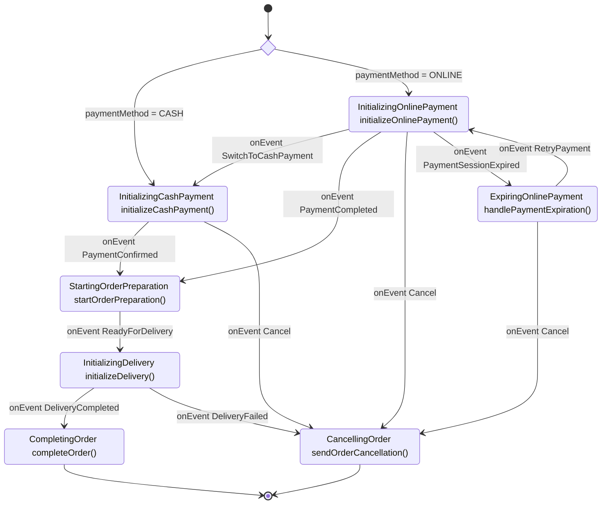

# FlowLite

FlowLite is a lightweight, developer-friendly workflow engine for Kotlin that makes defining business processes intuitive and maintainable. It provides a fluent API for defining process flows that are both easy to code and easy to understand.

## Why FlowLite?

Traditional business process management (BPM) solutions like Camunda are powerful but can be complex and heavyweight. FlowLite offers:

- **Developer-first approach**: Designed with Kotlin developers in mind
- **Type-safe fluent API**: Leverage Kotlin's type system to create robust workflows
- **Visual representation**: Automatically generates diagrams from your code
- **Minimal learning curve**: Natural syntax that reads like plain English
- **Customizable**: Easy to integrate with your existing codebase
- **Composable**: Build complex flows from smaller, reusable pieces
- **Lightweight**

## Assumptions
* FlowLite uses an Action-Oriented approach for stages, where stage names indicate ongoing activities (e.g., "InitializingPayment" rather than "PaymentInitialized")
* Each stage has an associated StageStatus (PENDING, IN_PROGRESS, COMPLETED, FAILED)
* The combination of stage and status (plus eventually retry_count and retry configuration) fully defines what the engine should do next
* Execution of the next step of the flow is triggered by a "execute next step in flow instance x" message
  * This messaging system can be replaced by a database scheduler
* Diagram below
  * Rectangle represent stages with their associated actions. Format: StageName `actionName()`
  * When an action fails, the stage will be marked with a status of failed (not shown in diagram)
  * It will be possible to add retry strategy for each stage.
  * Arrows represent transitions between stages, triggered by action completion (and status change) or events
  * Choice nodes represent routing decisions
  * Events can trigger stage transitions. They represent external triggers that change the process stage (e.g., `onEvent SwitchToCashPayment`)
  * Terminal stages are represented by transitions to `[*]`

### Parallel Execution (Idea)

FlowLite achieves parallelism through parent-child flow relationships.

#### Parent-Child Flow Model

FlowLite implements parallel execution using a parent-child flow model where:

- Parent flows can start one or more child flows
- Child flows execute independently and in parallel
- Parent flows can wait for specific child flows at designated stages
- The parent flow continues its own execution while child flows run

#### Diagram Example

The following diagram illustrates a typical parent-child flow pattern:


#### API for Parallel Execution

```kotlin
// Starting a child flow
fun <T : Any, R : Any> FlowBuilder<T>.startChildFlow(
    childFlowId: String,
    initialStateMapper: (parentState: T) -> R,
): FlowBuilder<T>

// Processing child flow results
fun <T : Any, R : Any> FlowBuilder<T>.waitForChildFlow(
    childFlowId: String,
    resultMapper: (parentState: T, childResult: R) -> T,
): FlowBuilder<T>
```

## TODO

* Review API once again and again :)
  * end should return parent flowbuilder ?
  * should onEvent return EventBuilder or new flow builder?
  * Type-Safe Builders onEvent(OrderEvent.PAYMENT_CONFIRMED) {doAction(::startOrderPreparation, OrderStatus.ORDER_PREPARATION_STARTED)} ?
  * Named Arguments better ?
* Define second flow?
* Implement API to the point that next step is possible
* Diagram generator and flow validator
* Full implementation of engine with working example
* Waiting on multiple events (event with conditional?)
* History of changes

## Process Example

### Diagram



## Code

See [PizzaDomain.kt](test/PizzaDomain.kt) and [PizzaOrderFlowTest.kt](test/PizzaOrderFlowTest.kt)
