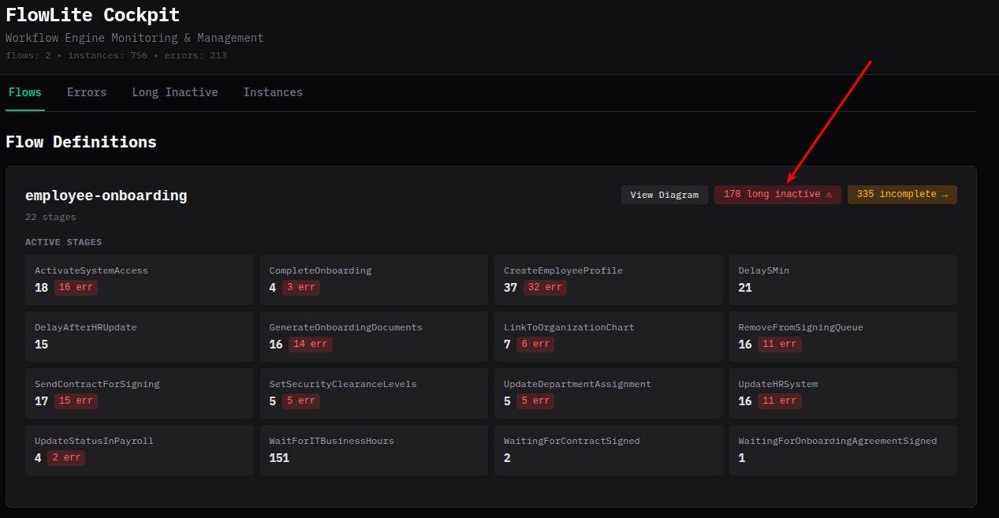

## [DONE 2026-04-12.1] Retry warning
> Retry on non-error rows requeues the current stage by sending the instance back through the same stage entry point.
I think this message shown on retry is not clear. Maybe just "Retry restarts the processing of the current stage." ?

> Agent:
> - Changes: Simplified the retry confirmation copy in the Cockpit action modal to `Retry restarts the processing of the current stage.`
> - Validation: Covered by `./gradlew test`.

## [DONE 2026-04-12.1] Flows tab
See: . Feedback to it:
* 178 long inactive is red like errors. This is misleading
* long inactive should only consider Running and "Pending engine"
* Maybe worth to add "errors" next to "long inactive" and "incomplete"?
* is incomplete best name? active? or simply "all" because on Flow tab we always show only incomplete and not canceled?

> Agent:
> - Changes: Reworked the flow shortcut chips so `long inactive` now uses an amber tone instead of the error red, added a separate `errors` chip when a flow has failures, and renamed the `incomplete` shortcut to `open`.
> - Changes: Aligned the default long-inactive definition in backend and UI to count only `Running` and pending-engine rows. Waiting-for-timer and waiting-for-event rows are no longer included by default.
> - Validation: Updated Cockpit service and Playwright coverage, then ran `./gradlew test` successfully.

## [DONE 2026-04-12.1] By default use timezone of the browser by default not UTC for timestamps on GUI

> Agent:
> - Changes: Switched GUI timestamp formatting from UTC to browser-local time while keeping a stable explicit timezone suffix in the rendered text.
> - Validation: Updated the Playwright assertion to verify browser-local `GMT...` output and ran `./gradlew test` successfully.

## [DONE 2026-04-12.1] Worth to add number of instances returned by backend
... somewhere on "Long inactive" and "Instances" tab?

> Agent:
> - Changes: Added `returned by backend: N` counters to the `Long inactive` and filtered `Instances` views.
> - Validation: Included in the green `./gradlew test` run.

## [DONE 2026-04-12.3] Many instances waiting on WaitForITBusinessHours on Render instance
... for more then 2h. Seems like some bug in our mechanism for sending events for seeded processes?

> Agent:
> - Response: I do not see an event-delivery bug here. `WaitForITBusinessHours` is a timer stage, not an event wait. It intentionally schedules the next wake-up in `Europe/Warsaw` business hours only.
> - Response: That means waits longer than 2h are expected whenever showcase onboarding instances are created after 17:00 Warsaw time, before 08:00 Warsaw time, or across a weekend.
> - Changes: Added explicit regression tests for the business-hours timer so we now cover same-day opening, after-hours next-day wake-up, and Friday-to-Monday weekend rollover.
> - Validation: `./gradlew test --tests io.flowlite.test.EmployeeOnboardingFlowTest`

## [DONE 2026-04-12.2] Feedback to "Implement recommendations from cockpit-scaling-notes.md"
> added a lazy backfill path so existing deployments with already-populated history can repopulate the new summary table on first Cockpit read

>> MG: That's not needed. Remove it.

> I did not persist `activityStatus`/`cockpitStatus` in this batch. The projection now removes the expensive history window query, but `activityStatus` is still derived in service code from stage definitions. That keeps the first step smaller and lower-risk while still addressing the main bottleneck shape.

>> MG: If you agree that this is a good change go for it

> Agent:
> - Changes: Removed the lazy backfill path entirely. Cockpit reads now use only the maintained summary table, and the summary repository API was simplified to explicit `all` versus `by flow` queries.
> - Changes: Added a regression test that proves history rows alone no longer repopulate the summary table during Cockpit reads.
> - Response: I did not persist `activityStatus` in the summary table in this batch. I do not think it is a good next step inside the current generic `SpringDataJdbcHistoryStore`, because that would couple a generic history projection to Cockpit-specific stage semantics and engine flow definitions. If we want to persist it later, I would do that through a cockpit-owned projector instead of pushing Cockpit knowledge into the generic store.
> - Validation: `./gradlew test`

## Playwright MCP or playwright-cli plus skills?
I've installed playwright MCP server. Please use it for exploratory tests. Also check
https://github.com/microsoft/playwright?tab=readme-ov-file#playwright-cli and https://github.com/microsoft/playwright/blob/main/.claude/skills/playwright-dev/SKILL.md and compare what is better. MCP or playwright-cli + skill. 

## [DONE 2026-04-12.3] [REOPEN] Sonar shows 0 coverage for tsx files

> Agent:
> - Response: Root cause was not missing instrumentation. The merged LCOV file used `SF:src/...` paths, while Sonar scans TSX sources from repo root as `cockpit-ui/src/...`, so Sonar could not match the coverage records back to the files it had indexed.
> - Changes: Updated the frontend coverage merge script to normalize coverage paths to repo-root-relative values before emitting `coverage-final.json` and `lcov.info`. That makes the final LCOV entries align with Sonar's `cockpit-ui/src` source tree.
> - Changes: Documented the new `-PfrontendCoverage=true` workflow in `README.md` and wired the main-branch CI Sonar job to enable frontend instrumentation explicitly.
> - Validation: Verified the merge script on a controlled coverage sample; the generated LCOV now emits `SF:cockpit-ui/src/App.tsx`.
> - Validation: `./gradlew -PfrontendCoverage=true test --tests io.flowlite.test.CockpitPlaywrightTest` stayed green in this container, but Playwright also reported missing host browser libraries and did not produce raw frontend coverage files here, so I could not re-check the fix against a real browser trace in this environment.

>> MG: Sonar still shows 0 coverage after recent changes. Check yourself if need here https://sonarcloud.io/component_measures?id=marcingurbisz_flowlite&metric=coverage&view=list

> Agent:
> - Response: I checked the Sonar page and confirmed the symptom: all `cockpit-ui/src/*.tsx` files still show `0.0%`.
> - Response: The remaining root cause was not Sonar path matching. The frontend coverage merge task was incorrectly modeled in Gradle: raw Playwright snapshots lived inside the report output directory, so `generateCockpitFrontendCoverage` could be treated as `UP-TO-DATE` and skip regenerating `lcov.info` after tests.
> - Changes: Moved raw frontend coverage snapshots to a separate `build/reports/playwright/frontend-coverage-raw` directory and declared that directory as an explicit input to the merge task.
> - Changes: Kept the report output in `build/reports/playwright/frontend-coverage`, so the Sonar path stays stable while the merge task now actually reruns when new raw snapshots appear.
> - Changes: Stabilized one Playwright scenario that timed out only under frontend instrumentation, so the `-PfrontendCoverage=true` pipeline completes end-to-end.
> - Validation: `./gradlew -PfrontendCoverage=true test --tests io.flowlite.test.CockpitPlaywrightTest` now produces `build/reports/playwright/frontend-coverage/lcov.info` plus a merged coverage summary instead of leaving only raw JSON snapshots.

## [DONE 2026-04-12.3] Question to queries
```
interface FlowLiteInstanceSummaryRepository : CrudRepository<FlowLiteInstanceSummaryRow, UUID> {
    @Query(
        """
        select *
        from flowlite_instance_summary
        where (:flowId is null or flow_id = :flowId)
        order by flow_id asc, updated_at desc, flow_instance_id asc
        """,
    )
    fun findAllSummaries(flowId: String?): List<FlowLiteInstanceSummaryRow>

    @Query(
        """
        select *
        from flowlite_instance_summary
        where flow_id = :flowId and flow_instance_id = :flowInstanceId
        limit 1
        """,
    )
    fun findSummary(flowId: String, flowInstanceId: UUID): FlowLiteInstanceSummaryRow?
}
```

Why :flowId is null and limit 1? I think flowId should never be null and there should always be only one row for flowInstanceId.

> Agent:
> - Response: `flowId` was nullable only because one repository method was serving both "all summaries" and "one-flow summaries". I agreed that this API was too loose and removed that nullable shape.
> - Changes: Split the repository into explicit `findAllSummaries()` and `findAllSummariesByFlowId(flowId)` methods.
> - Response: `limit 1` on `findSummary` was redundant because the table already has the unique key `(flow_id, flow_instance_id)`. I removed that clause.
> - Validation: `./gradlew test`

## [DONE 2026-04-12.3] What do you think about adding 3 index on status, stage and instance id?
... these will be quite frequent queries to FlowLiteInstanceSummary tables from "Instances" tab.

> Agent:
> - Response: I would not add those three single-column indexes in the current shape.
> - Response: Right now Cockpit loads `flowlite_instance_summary` rows by flow/all and then applies most `Instances` filtering in JVM code. Because the SQL does not predicate on `status`, `stage`, or free-text instance search, those indexes would not materially help the hot path yet.
> - Response: If we later push `Instances` filtering into SQL, then the useful indexes will be composite indexes that match the actual predicates and sort order, not three independent indexes by default.
> - Response: The existing unique key on `(flow_id, flow_instance_id)` and the `(flow_id, updated_at, flow_instance_id)` ordering index are the right base indexes for the current query plan.

## [DONE 2026-04-12.3] [REOPEN] Frontend and backend sources together
Moving cockpit-ui/src under source/cockpit. Pros and cons?

> Agent:
> - Response: I would keep them separate in this repo.
> - Response: Main upside of moving `cockpit-ui/src` under `source/cockpit` is locality: one subtree for the whole Cockpit feature, easier side-by-side browsing of router/service/frontend code, and a slightly stronger signal that Cockpit is one product slice rather than two semi-independent projects.
> - Response: The downsides are more important here. Kotlin/Gradle/JVM sources and Vite/TypeScript/browser sources have different toolchains, cache directories, dependency graphs, and packaging assumptions. Mixing them under one source tree makes source-set rules, Sonar scoping, IDE indexing, and future publishing boundaries less clear. It also obscures the fact that the frontend is an independently buildable static app with its own lifecycle.
> - Response: My recommendation is: keep the dedicated top-level `cockpit-ui/` project, but continue tightening naming and docs so the conceptual ownership is obvious. If you ever shrink the frontend into a tiny mostly-static bundle, then revisiting a co-located layout would make more sense.

>> MG: Get the point but still I'm not fully convinced :). Can you enumerate what we would need to change in fe and be build system to have the sources together?

> Agent:
> - Response: Yes. If we colocated the frontend sources under `source/cockpit`, the build-system changes would be concrete rather than cosmetic.
> - Response: Gradle source sets: we would need to stop treating the whole `source/` tree as both Kotlin sources and JVM resources, otherwise the frontend source tree would be swept into `processResources`. That means redefining `sourceSets.main.resources` to exclude the frontend subtree or moving JVM resources to a narrower directory.
> - Response: Frontend tool root: Vite, TypeScript, `package.json`, lockfile, and `node_modules` would need either a new root under `source/cockpit` or a top-level package file that points into that subtree. Today the frontend build assumes `cockpit-ui/` is its working directory.
> - Response: Gradle frontend tasks: `installCockpitUiDeps`, `buildCockpitUi`, coverage merge paths, and dist sync paths would all need their working directory and input globs rewritten away from `cockpit-ui/**`.
> - Response: Sonar config: `sonar.sources`, `sonar.tests`, and frontend LCOV path normalization would need to move from `cockpit-ui/src` and `cockpit-ui/tests` to the new colocated paths.
> - Response: Test/resource packaging: the copy-to-test-app step would still need to publish a built static dist into test resources; colocating sources does not remove that packaging boundary.
> - Response: Developer tooling: TS config, Vite config, IDE excludes, and cache ignores would all need to be retargeted so TypeScript artifacts do not pollute the JVM `source/` tree.
> - Response: So it is feasible, but it is a real Gradle/Vite/source-set reshaping task, not just a folder move.

## [FOR HUMAN] review for improvements
* Research: How Peter and Simon are handling that (prompts, workflows)

## [FOR HUMAN] Review git changes
* Review perf(engine): raise tick worker default 3/25/26, 9:13 AM marcingurbisz
* loop starting from 75abfec728b2184501ae4ebae0c83c07f1e0ba23
* loops starting from
  * docs: TODO update marcingurbisz 3/8/26, 9:12 AM
  * docs: update TODO marcingurbisz 3/7/26, 3:57 PM
  * docs: update TODO marcingurbisz 3/6/26, 7:13 AM

## [ON HOLD] Topics on hold for now
* Check sonar findings and decide if they should be fixed
* Concept for "Auto-retry" and "User retriable"
* Long Inactive tab
  * Default filter should be "Running and Pending scheduler"
* Think about making CockpitStatus and engine Status the same
* Consider virtual scrolling for the `Instances` tab.
  > Agent:
  > - Response: Considered but intentionally not implemented in this batch. After the gated `Instances` tab and backend-filtered heavy views, virtual scrolling is no longer the first bottleneck. I still recommend it as a later follow-up if filtered result sets themselves become large in production.
* Visual testing - comparing screenshots before and after changes? Not sure about it because when agent can
see produced image maybe this be enough for visual inspection and comparing will not be needed?
* Check coverage and suggest modifications/new tests to cover it
* There are no logs that show how the /flows /instances processing goes. Now I cannot find out whether the query takes so long or it is processing in JVM code.
* The GWT cleanup showed that the Cockpit Playwright spec now needs a small `RecordedPageSession` helper to keep browser setup/actions in `when` blocks while preserving failure screenshots/videos. If we add more browser scenarios, it may be worth introducing a tiny test DSL/helper layer for `open page -> act -> assert -> close` flows so future specs do not repeat the same session lifecycle/synchronization plumbing.
* Websocket for live refresh
* New/duplicate cockpit but in Kotlin
