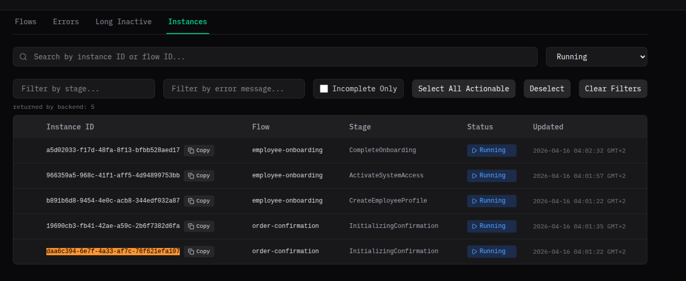
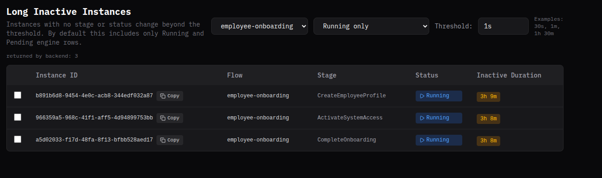
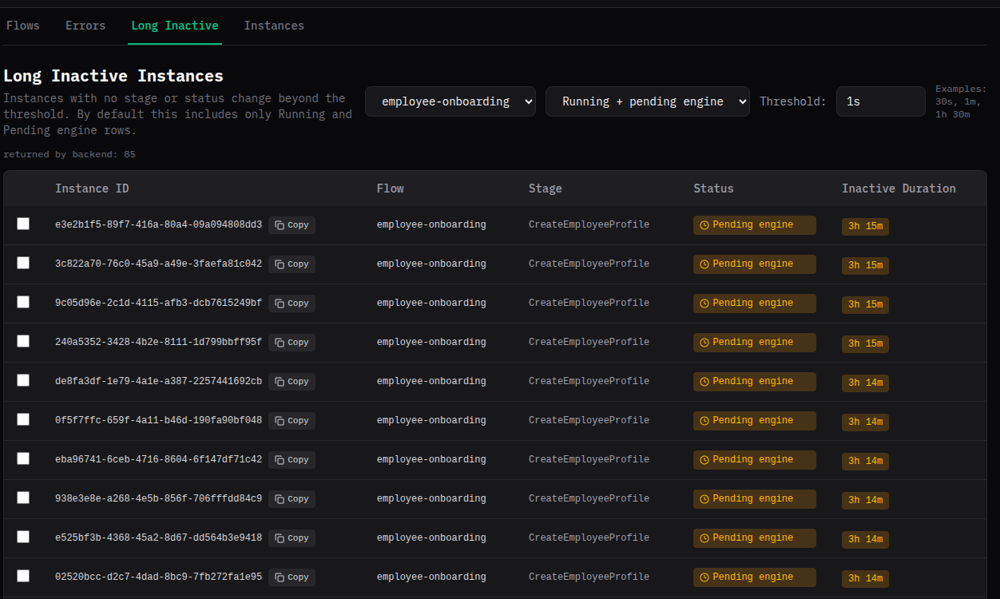
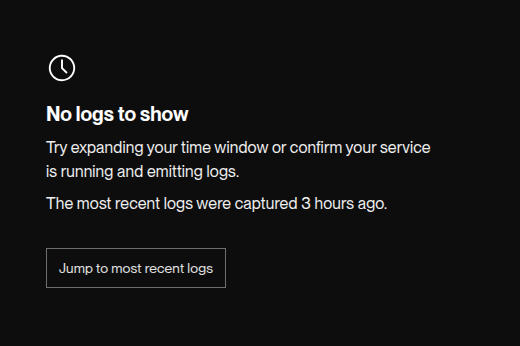

## Stall on render at 6.5k instances
See images 

On render 
No logs since 4am. Render instance is small 512MB RAM.
Any idea what happen?
Web requests are working. Do we log anything when request is served?
From the logs it seems that instance started to work again around 7:30 but then around 8am instance stopped responding and render killed it.

## [REOPEN] Aligning CockpitStatus and StageStatus
What do you think about using in StageStatus the same statuses as we have now in CockpitStatus, effectively removing the need to have separate CockpitStatus? Consider that we do not have yet any clients and we are in alpha phase. No need for backward compatibility.
What are pros, cons and your recommendation.
Related topic: I see setCockpitStatusResolver - this introduce kind of circular dependency between engine and history store, right? I do not like that.

> Agent: Picking this item in loop `2026-04-15.1` together with the linked Cockpit follow-ups below, because the status-model design, summary projection, long-inactive behavior, and worker defaults are all part of the same Cockpit/runtime batch.

> Agent:
> - Response: I would still keep `StageStatus` and `CockpitStatus` separate. `StageStatus` is the engine control model (`Pending`, `Running`, `Error`, `Completed`, `Cancelled`) and is used directly in claim/retry/cancel/manual-stage transitions. `CockpitStatus` is an observability/read-model split of the non-running branch of that state machine.
> - Response: The main upside of merging them would be one enum, one persisted status column, no `cockpit_status` projection, and no resolver hook between engine bootstrap and summary updates.
> - Response: The main downside is that engine semantics would become stage-definition-aware at the core runtime layer. `WaitingForTimer`, `WaitingForEvent`, and `PendingEngine` are not just extra labels; they require the engine to know whether a stage is timer-driven or event-driven whenever it sets or compares status. That would spread flow-definition knowledge into claim/release logic, retry paths, status history, persistence contracts, and tests.
> - Response: So yes, `setCockpitStatusResolver(...)` is a circular-style hookup and I do not like the shape either, but I do not think collapsing the enums is the best fix for it. My recommendation is: keep separate engine and Cockpit statuses, and later remove the setter by introducing a dedicated flow-definition catalog/classifier bean or a Cockpit-owned projector instead of pushing that wiring through `SpringDataJdbcHistoryStore`.
> - Validation: Re-checked current `Engine`, `StageStatus`, `SpringDataJdbcHistoryStore`, and Cockpit status-classification flow while answering this item.

>> MG: Would it complicate engine code much? From my pov when looking at flow table and seeing WaitingForTimer instead Pending is a benefit.

## [ONHOLD] Frontend and backend sources together
Moving cockpit-ui/src under source/cockpit. Pros and cons?

> Agent:
> I would keep them separate in this repo.
> Main upside of moving `cockpit-ui/src` under `source/cockpit` is locality: one subtree for the whole Cockpit feature, easier side-by-side browsing of router/service/frontend code, and a slightly stronger signal that Cockpit is one product slice rather than two semi-independent projects.
> The downsides are more important here. Kotlin/Gradle/JVM sources and Vite/TypeScript/browser sources have different toolchains, cache directories, dependency graphs, and packaging assumptions. Mixing them under one source tree makes source-set rules, Sonar scoping, IDE indexing, and future publishing boundaries less clear. It also obscures the fact that the frontend is an independently buildable static app with its own lifecycle.
> My recommendation is: keep the dedicated top-level `cockpit-ui/` project, but continue tightening naming and docs so the conceptual ownership is obvious. If you ever shrink the frontend into a tiny mostly-static bundle, then revisiting a co-located layout would make more sense.

>> MG: Get the point but still I'm not fully convinced :). Can you enumerate what we would need to change in fe and be build system to have the sources together?

> Agent:
> Yes. If we colocated the frontend sources under `source/cockpit`, the build-system changes would be concrete rather than cosmetic.
> Gradle source sets: we would need to stop treating the whole `source/` tree as both Kotlin sources and JVM resources, otherwise the frontend source tree would be swept into `processResources`. That means redefining `sourceSets.main.resources` to exclude the frontend subtree or moving JVM resources to a narrower directory.
> Frontend tool root: Vite, TypeScript, `package.json`, lockfile, and `node_modules` would need either a new root under `source/cockpit` or a top-level package file that points into that subtree. Today the frontend build assumes `cockpit-ui/` is its working directory.
> Gradle frontend tasks: `installCockpitUiDeps`, `buildCockpitUi`, coverage merge paths, and dist sync paths would all need their working directory and input globs rewritten away from `cockpit-ui/**`.
> Sonar config: `sonar.sources`, `sonar.tests`, and frontend LCOV path normalization would need to move from `cockpit-ui/src` and `cockpit-ui/tests` to the new colocated paths.
> Test/resource packaging: the copy-to-test-app step would still need to publish a built static dist into test resources; colocating sources does not remove that packaging boundary.
> Developer tooling: TS config, Vite config, IDE excludes, and cache ignores would all need to be retargeted so TypeScript artifacts do not pollute the JVM `source/` tree.
> So it is feasible, but it is a real Gradle/Vite/source-set reshaping task, not just a folder move.

## [FOR HUMAN] review for improvements
* Research: How Peter and Simon are handling that (prompts, workflows)

## [FOR HUMAN] Review git changes
* Review perf(engine): raise tick worker default 3/25/26, 9:13 AM marcingurbisz
* loop starting from 75abfec728b2184501ae4ebae0c83c07f1e0ba23
* loops starting from
  * docs: TODO update marcingurbisz 3/8/26, 9:12 AM
  * docs: update TODO marcingurbisz 3/7/26, 3:57 PM
  * docs: update TODO marcingurbisz 3/6/26, 7:13 AM

## [ON HOLD] Topics on hold for now
* Check sonar findings and decide if they should be fixed
* Concept for "Auto-retry" and "User retriable"
* Long Inactive tab
  * Default filter should be "Running and Pending scheduler"
* Think about making CockpitStatus and engine Status the same
* Consider virtual scrolling for the `Instances` tab.
  > Agent:
  > Considered but intentionally not implemented in this batch. After the gated `Instances` tab and backend-filtered heavy views, virtual scrolling is no longer the first bottleneck. I still recommend it as a later follow-up if filtered result sets themselves become large in production.
* Visual testing - comparing screenshots before and after changes? Not sure about it because when agent can
see produced image maybe this be enough for visual inspection and comparing will not be needed?
* Check coverage and suggest modifications/new tests to cover it
* There are no logs that show how the /flows /instances processing goes. Now I cannot find out whether the query takes so long or it is processing in JVM code.
* The GWT cleanup showed that the Cockpit Playwright spec now needs a small `RecordedPageSession` helper to keep browser setup/actions in `when` blocks while preserving failure screenshots/videos. If we add more browser scenarios, it may be worth introducing a tiny test DSL/helper layer for `open page -> act -> assert -> close` flows so future specs do not repeat the same session lifecycle/synchronization plumbing.
* Websocket for live refresh
* New/duplicate cockpit but in Kotlin
